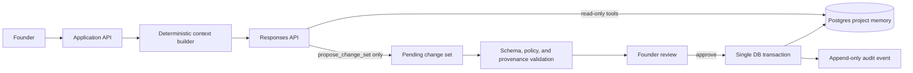
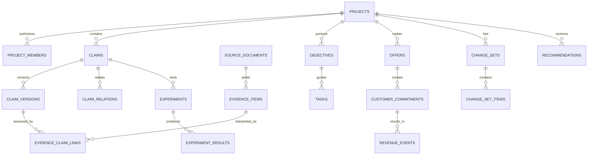

# AI Cofounder Database Schema and LLM Tool Contract

> Status: proposed implementation design. This document describes the target state and an incremental migration path; it is **not** a migration to run unchanged against production.

## 1. Executive design

The system needs two durable layers:

1. **Operational records** — tasks, experiments, milestones, offers, commitments, and revenue events that describe work or business events.
2. **An evidence-backed claim graph** — versioned beliefs about the startup, with source provenance, counterevidence, scope, confidence, and relationships.

`projects` remains a fast, founder-editable snapshot, but a material statement in that snapshot must point to a canonical claim. The LLM never directly mutates either layer. It can read narrowly scoped context and submit one **change set** for backend validation and founder approval.



This separation is deliberate:

- An LLM can **suggest** that a buyer, pricing hypothesis, or result changed; it cannot make it company truth.
- A source and the AI’s interpretation of that source are separate records.
- A decision can rely on an uncertain claim without turning that claim into a fact.
- Current state is fast to query, but important history is never overwritten.

## 2. Decisions that constrain the schema

| Decision | Resulting design |
| --- | --- |
| The founder owns company direction. | Material AI updates are pending change sets until founder approval. |
| Early-stage knowledge is conditional. | Claims include a scope JSON object (segment, role, geography, offer, price, channel, time/conditions). |
| Evidence may be mixed. | Evidence-to-claim links are independent, versioned interpretations; both support and contradiction are retained. |
| Current fields must stay convenient for UI. | `project_snapshot_fields` projects selected current claim versions into a read model rather than treating a `projects` column as historical truth. |
| The app will become multi-user. | Use `project_members` for authorization; do not expand the insecure request header owner pattern. |
| The LLM may be wrong. | It only receives project-scoped read tools and one draft-write tool. Deterministic services validate every draft. |
| Reproducibility matters. | Recommendations, scores, prompt/model/policy versions, and context source IDs are persisted. |
| Financial data must not be invented. | `revenue_events` record observed payment state and external provider references; an LLM may only propose a draft based on founder-provided evidence. |

## 3. Target entity map

### 3.1 Core entities

| Table | Purpose | Mutability |
| --- | --- | --- |
| `projects` | Project identity and shallow operational status. | Selected fields update; material beliefs project through claims. |
| `project_members` | Project roles and authorization. | Versioned/audited membership changes. |
| `claims` | Stable identity of a material belief. | Lifecycle/current-version pointer updates only. |
| `claim_versions` | Every materially different formulation or assessment of a claim. | Append-only. |
| `claim_relations` | `depends_on`, `narrows`, `conflicts_with`, `derived_from`, and similar graph edges. | Append-only / retired, not overwritten. |
| `project_snapshot_fields` | Fast current values for fields such as target customer and price, with a claim/version source. | Rebuilt or transactionally projected. |
| `source_documents` | A raw or externally referenced source: interview, sales call, note, report, analytics export. | Content is immutable; redaction is a new version/reference. |
| `evidence_items` | Atomic observation, quote, metric, or event extracted from a source. | Append-only. |
| `evidence_claim_links` | The interpretation of one evidence item relative to one claim version. | Append-only; new interpretation supersedes an old one. |
| `decisions` | A founder-approved operating choice. | Status/review/supersession update; rationale versions preserved. |
| `objectives` | Short-horizon outcome or milestone the system should optimize next. | Status changes; meaningful edits versioned. |
| `tasks` | Owned unit of known work. | Status and scheduling update; completion evidence appended. |
| `experiments` | Pre-registered test of one or more hypothesis claims. | Design is locked at start; results are append-only. |
| `experiment_results` | Checkpoint or final experiment interpretation. | Append-only. |
| `offers` | A concrete offer, package, price, and delivery boundary. | Versioned by new offer revision. |
| `customer_commitments` | Customer-intended or contractual obligation. | Status updates with audit. |
| `revenue_events` | Financially attributable payment/credit/refund observation. | Append-only and provider-referenced. |

### 3.2 Control-plane entities

| Table | Purpose |
| --- | --- |
| `change_sets` | A bounded group of proposed state changes awaiting validation/approval. |
| `change_set_items` | Typed individual operations inside a change set. |
| `recommendations` | The ranked immediate action and explanation shown to the founder. |
| `conversation_sessions` / `conversation_turns` | User/AI turns, structured extraction candidates, response IDs, and session summaries. |
| `context_packets` | The input-state snapshot and source IDs given to a model for a substantive turn. |
| `audit_events` | Immutable actor/action/event trail for every material mutation. |
| `policy_versions` | Versioned scoring weights, eligibility rules, and manual/prompt contracts. |

### 3.3 Key relationships



## 4. Canonical knowledge semantics

### 4.1 `claims` is the source of truth for beliefs

A **claim** is one stable question or proposition, such as “Independent bookkeepers can buy without firm approval.” Its versions express what the team currently believes and why.

The design intentionally separates four dimensions:

| Dimension | Example values | Why it cannot be one `status` column |
| --- | --- | --- |
| `epistemic_type` | `founder_statement`, `assumption`, `hypothesis`, `inference`, `fact`, `finding` | States how the claim entered memory. |
| `validation_status` | `untested`, `testing`, `mixed`, `supported`, `contradicted`, `invalidated`, `accepted_for_scope` | States the evidence position. |
| `lifecycle_status` | `proposed`, `active`, `superseded`, `retired` | States whether the company is using it. |
| `operating_effect` | `informational`, `decision_input`, `revenue_blocker`, `safety_blocker` | States why it matters now. |

Example: “We will sell a $300 setup pilot” is an active, founder-approved **decision**. “Three of ten bookkeepers will pay $300” is a high-impact **hypothesis**. A payment from one bookkeeper is an **observed fact** scoped to that offer and customer. None of these records substitutes for another.

### 4.2 Claim scope

Use `jsonb` only for bounded, optional dimensions that vary by claim. The queryable, core dimensions should still be columns or normalized relations.

```json
{
  "customer_segment": "independent bookkeepers with 1–10 employees",
  "buyer_role": "owner",
  "geography": "United States",
  "offer_id": "f23e…",
  "price_minor": 30000,
  "currency": "USD",
  "channel": "founder-led email",
  "conditions": ["manual onboarding", "30-day pilot"]
}
```

No tool may omit scope intentionally to make a claim look more general than its evidence allows.

### 4.3 Evidence semantics

- `source_documents` preserves the source and collection metadata.
- `evidence_items` stores a small, attributable unit: an exact quote, behavior, metric, or documented event.
- `evidence_claim_links` records whether that item supports, contradicts, is mixed, or does not address a particular **claim version**.
- An AI summary is an interpretation with `actor_type = 'ai'`; it is never the only evidence for a claim if a durable source exists.
- Payment is a stronger signal for a scoped willingness-to-pay claim than a stated preference, but does not validate retention or acquisition economics.

## 5. Target PostgreSQL schema

### 5.1 Conventions

- Use `uuid` identifiers generated by `gen_random_uuid()`.
- Use `timestamptz`, always in UTC.
- Use lowercase `text` with `CHECK` constraints for evolving product taxonomies instead of Postgres enums. New categories then do not require an enum rewrite/redeploy.
- Use `numeric(14,2)` only for a human-entered price display; use `amount_minor bigint` plus `currency char(3)` for payment amounts.
- Use `jsonb` for bounded, schema-validated payloads (`scope`, experiment design, score snapshots), not to hide core relationships.
- All IDs accepted from a browser or tool call are checked for project membership in the query/transaction; an ID alone is never authority.
- `created_at` rows in evidence, versions, results, and audit tables are immutable. Corrections add a replacement/superseding record.

### 5.2 Security and tenancy foundation

This fresh-deployment DDL is representative. It assumes Supabase Auth when the app is exposed directly to a browser. If the Node API remains the sole database client for the local milestone, keep the same membership queries in its repository layer; do **not** treat `x-user-id` as production authentication.

```sql
create extension if not exists pgcrypto;

create table projects (
  id uuid primary key default gen_random_uuid(),
  owner_user_id uuid not null references auth.users(id) on delete restrict,
  name text not null check (char_length(name) between 1 and 160),
  status text not null default 'active'
    check (status in ('active', 'paused', 'archived')),
  stage text not null default 'orientation'
    check (stage in ('orientation', 'customer_problem', 'solution_offer',
                     'paid_commitment', 'first_revenue', 'repeatability',
                     'pivoting')),
  stage_confidence text not null default 'low'
    check (stage_confidence in ('very_low', 'low', 'moderate', 'high')),
  founder_goal text,
  founder_constraints text,
  created_at timestamptz not null default now(),
  updated_at timestamptz not null default now()
);

create table project_members (
  project_id uuid not null references projects(id) on delete cascade,
  user_id uuid not null references auth.users(id) on delete cascade,
  role text not null check (role in ('owner', 'editor', 'advisor', 'viewer')),
  created_at timestamptz not null default now(),
  primary key (project_id, user_id)
);

create index project_members_user_project_idx on project_members (user_id, project_id);

create or replace function set_updated_at()
returns trigger language plpgsql as $$
begin
  new.updated_at = now();
  return new;
end;
$$;

create trigger projects_set_updated_at
before update on projects
for each row execute function set_updated_at();
```

### 5.3 Claims, versions, relations, and snapshot projection

```sql
create table claims (
  id uuid primary key default gen_random_uuid(),
  project_id uuid not null references projects(id) on delete cascade,
  topic text not null,
  -- Stable, narrow identifier such as 'target_customer', 'buyer_authority',
  -- 'problem_frequency', 'price_willingness', or 'distribution_channel'.
  lifecycle_status text not null default 'proposed'
    check (lifecycle_status in ('proposed', 'active', 'superseded', 'retired')),
  operating_effect text not null default 'informational'
    check (operating_effect in ('informational', 'decision_input',
                                'revenue_blocker', 'safety_blocker')),
  importance smallint not null default 3 check (importance between 1 and 5),
  current_version_id uuid,
  created_by_type text not null
    check (created_by_type in ('founder', 'ai', 'system', 'import')),
  created_by_user_id uuid references auth.users(id) on delete set null,
  created_at timestamptz not null default now(),
  retired_at timestamptz
);

create table claim_versions (
  id uuid primary key default gen_random_uuid(),
  claim_id uuid not null references claims(id) on delete cascade,
  version_no integer not null check (version_no > 0),
  statement text not null check (char_length(statement) between 1 and 6000),
  epistemic_type text not null check (epistemic_type in
    ('fact', 'founder_statement', 'assumption', 'hypothesis', 'inference',
     'decision_input', 'finding')),
  validation_status text not null default 'untested' check (validation_status in
    ('untested', 'testing', 'mixed', 'supported', 'contradicted',
     'invalidated', 'accepted_for_scope')),
  confidence_band text not null default 'low' check (confidence_band in
    ('very_low', 'low', 'moderate', 'high')),
  scope jsonb not null default '{}'::jsonb check (jsonb_typeof(scope) = 'object'),
  rationale text,
  supporting_summary text,
  contradicting_summary text,
  source_turn_id uuid,
  created_by_type text not null
    check (created_by_type in ('founder', 'ai', 'system', 'import')),
  created_by_user_id uuid references auth.users(id) on delete set null,
  created_at timestamptz not null default now(),
  unique (claim_id, version_no)
);

alter table claims
  add constraint claims_current_version_fk
  foreign key (current_version_id) references claim_versions(id)
  on delete restrict;

create table claim_relations (
  id uuid primary key default gen_random_uuid(),
  project_id uuid not null references projects(id) on delete cascade,
  from_claim_id uuid not null references claims(id) on delete cascade,
  to_claim_id uuid not null references claims(id) on delete cascade,
  relation_type text not null check (relation_type in
    ('depends_on', 'narrows', 'conflicts_with', 'derived_from', 'tests',
     'informs_decision', 'supersedes_scope')),
  rationale text,
  active boolean not null default true,
  created_at timestamptz not null default now(),
  retired_at timestamptz,
  check (from_claim_id <> to_claim_id)
);

create table project_snapshot_fields (
  project_id uuid not null references projects(id) on delete cascade,
  field_name text not null check (field_name in
    ('target_customer', 'target_buyer', 'problem_statement', 'solution_summary',
     'value_proposition', 'revenue_model', 'pricing_hypothesis',
     'sales_motion', 'primary_channel', 'first_revenue_definition')),
  value_text text not null,
  claim_id uuid not null references claims(id) on delete restrict,
  claim_version_id uuid not null references claim_versions(id) on delete restrict,
  approval_state text not null check (approval_state in
    ('founder_confirmed', 'founder_provided', 'ai_draft')),
  updated_at timestamptz not null default now(),
  primary key (project_id, field_name)
);

create index claims_project_active_idx
  on claims (project_id, operating_effect, importance desc, created_at desc)
  where lifecycle_status = 'active';
create index claim_versions_claim_version_idx
  on claim_versions (claim_id, version_no desc);
create index claim_relations_project_from_idx
  on claim_relations (project_id, from_claim_id)
  where active;
```

**Integrity rule implemented in service code.** A transaction that moves `claims.current_version_id` must verify that the selected version belongs to the same claim and contains the intended approval state. A plain foreign key cannot express that invariant alone.

### 5.4 Sources, evidence, and interpretations

```sql
create table source_documents (
  id uuid primary key default gen_random_uuid(),
  project_id uuid not null references projects(id) on delete cascade,
  source_type text not null check (source_type in
    ('customer_interview', 'sales_call', 'survey', 'landing_page', 'analytics',
     'paid_pilot', 'payment_provider', 'competitor_research', 'market_research',
     'founder_note', 'uploaded_document', 'system_event')),
  title text not null check (char_length(title) between 1 and 300),
  observed_at timestamptz,
  captured_at timestamptz not null default now(),
  source_url text,
  external_ref text,
  participant_role text,
  participant_segment text,
  collection_method text,
  raw_content text,
  content_hash text,
  privacy_class text not null default 'project_private'
    check (privacy_class in ('project_private', 'sensitive', 'restricted')),
  created_by_type text not null
    check (created_by_type in ('founder', 'ai', 'system', 'import')),
  created_by_user_id uuid references auth.users(id) on delete set null,
  created_at timestamptz not null default now()
);

create table evidence_items (
  id uuid primary key default gen_random_uuid(),
  project_id uuid not null references projects(id) on delete cascade,
  source_document_id uuid references source_documents(id) on delete set null,
  evidence_type text not null check (evidence_type in
    ('quote', 'reported_behavior', 'observed_behavior', 'metric', 'payment',
     'commitment', 'objection', 'research_fact', 'system_observation')),
  content text not null check (char_length(content) between 1 and 8000),
  measurement jsonb not null default '{}'::jsonb
    check (jsonb_typeof(measurement) = 'object'),
  evidence_strength text not null default 'weak'
    check (evidence_strength in ('weak', 'moderate', 'strong')),
  behavior_signal text not null default 'opinion'
    check (behavior_signal in ('opinion', 'stated_intent', 'behavior',
                                'commitment', 'payment')),
  observed_at timestamptz,
  created_by_type text not null
    check (created_by_type in ('founder', 'ai', 'system', 'import')),
  created_at timestamptz not null default now()
);

create table evidence_claim_links (
  id uuid primary key default gen_random_uuid(),
  project_id uuid not null references projects(id) on delete cascade,
  evidence_item_id uuid not null references evidence_items(id) on delete cascade,
  claim_version_id uuid not null references claim_versions(id) on delete cascade,
  relationship text not null check (relationship in
    ('supports', 'contradicts', 'mixed', 'does_not_address')),
  relevance_strength text not null check (relevance_strength in
    ('weak', 'moderate', 'strong')),
  interpretation text not null,
  interpreted_by_type text not null
    check (interpreted_by_type in ('founder', 'ai', 'system', 'import')),
  source_turn_id uuid,
  supersedes_id uuid references evidence_claim_links(id) on delete restrict,
  created_at timestamptz not null default now(),
  check (supersedes_id is null or supersedes_id <> id)
);

create index source_documents_project_observed_idx
  on source_documents (project_id, observed_at desc nulls last, created_at desc);
create unique index source_documents_project_external_ref_idx
  on source_documents (project_id, external_ref)
  where external_ref is not null;
create index evidence_items_project_observed_idx
  on evidence_items (project_id, observed_at desc nulls last, created_at desc);
create index evidence_claim_links_claim_idx
  on evidence_claim_links (claim_version_id, created_at desc);
create index evidence_claim_links_evidence_idx
  on evidence_claim_links (evidence_item_id);
```

`source_documents.raw_content` should be encrypted or held in private object storage if it may include recordings, health data, or identifiable customer information. The model normally receives the minimum safe evidence excerpt, not unrestricted raw content.

### 5.5 Objectives, decisions, execution, experiments, and revenue

```sql
create table objectives (
  id uuid primary key default gen_random_uuid(),
  project_id uuid not null references projects(id) on delete cascade,
  parent_objective_id uuid references objectives(id) on delete set null,
  title text not null,
  outcome_definition text not null,
  success_metric text not null,
  status text not null default 'proposed'
    check (status in ('proposed', 'active', 'completed', 'paused', 'skipped')),
  horizon text not null check (horizon in ('now', 'next', 'later')),
  position integer not null default 0,
  source_claim_id uuid references claims(id) on delete set null,
  created_at timestamptz not null default now(),
  updated_at timestamptz not null default now()
);

create table decisions (
  id uuid primary key default gen_random_uuid(),
  project_id uuid not null references projects(id) on delete cascade,
  title text not null,
  decision_text text not null,
  rationale text not null,
  status text not null default 'active'
    check (status in ('proposed', 'active', 'superseded', 'reversed', 'archived')),
  reversibility text not null check (reversibility in ('easy', 'moderate', 'hard')),
  review_trigger text,
  decided_by_user_id uuid references auth.users(id) on delete set null,
  approved_at timestamptz,
  supersedes_decision_id uuid references decisions(id) on delete restrict,
  created_at timestamptz not null default now(),
  updated_at timestamptz not null default now()
);

create table decision_claim_links (
  decision_id uuid not null references decisions(id) on delete cascade,
  claim_version_id uuid not null references claim_versions(id) on delete restrict,
  relationship text not null check (relationship in
    ('assumption', 'support', 'counterevidence', 'constraint', 'review_trigger')),
  primary key (decision_id, claim_version_id, relationship)
);

create table tasks (
  id uuid primary key default gen_random_uuid(),
  project_id uuid not null references projects(id) on delete cascade,
  objective_id uuid references objectives(id) on delete set null,
  title text not null,
  description text,
  kind text not null check (kind in
    ('execution', 'learning_support', 'customer_commitment', 'maintenance')),
  status text not null default 'todo'
    check (status in ('todo', 'doing', 'blocked', 'done', 'skipped')),
  priority text not null default 'medium' check (priority in ('high', 'medium', 'low')),
  definition_of_done text not null,
  expected_outcome text,
  owner_user_id uuid references auth.users(id) on delete set null,
  due_at timestamptz,
  estimated_minutes integer check (estimated_minutes between 1 and 2880),
  blocked_reason text,
  completed_at timestamptz,
  created_at timestamptz not null default now(),
  updated_at timestamptz not null default now()
);

create table experiments (
  id uuid primary key default gen_random_uuid(),
  project_id uuid not null references projects(id) on delete cascade,
  title text not null,
  hypothesis_claim_id uuid not null references claims(id) on delete restrict,
  hypothesis_version_id uuid not null references claim_versions(id) on delete restrict,
  decision_id uuid references decisions(id) on delete set null,
  status text not null default 'proposed'
    check (status in ('proposed', 'running', 'paused', 'completed', 'cancelled')),
  design jsonb not null check (jsonb_typeof(design) = 'object'),
  -- design has method, target population, sample/effort, time/cost budget,
  -- success, stop, and mixed-result criteria, confounders, and ethics notes.
  design_locked_at timestamptz,
  started_at timestamptz,
  completed_at timestamptz,
  created_at timestamptz not null default now(),
  updated_at timestamptz not null default now()
);

create table experiment_results (
  id uuid primary key default gen_random_uuid(),
  experiment_id uuid not null references experiments(id) on delete cascade,
  result_kind text not null check (result_kind in ('checkpoint', 'final')),
  result_data jsonb not null check (jsonb_typeof(result_data) = 'object'),
  interpretation text not null,
  outcome text not null check (outcome in
    ('supports', 'contradicts', 'mixed', 'inconclusive', 'invalid_test')),
  reported_by_type text not null check (reported_by_type in ('founder', 'ai', 'system', 'import')),
  approved_by_user_id uuid references auth.users(id) on delete set null,
  created_at timestamptz not null default now(),
  unique (experiment_id, result_kind)
);

create table offers (
  id uuid primary key default gen_random_uuid(),
  project_id uuid not null references projects(id) on delete cascade,
  version_no integer not null check (version_no > 0),
  title text not null,
  target_segment text not null,
  promised_outcome text not null,
  delivery_boundary text not null,
  price_minor bigint check (price_minor >= 0),
  currency char(3),
  payment_terms text,
  status text not null default 'draft'
    check (status in ('draft', 'active', 'retired')),
  created_at timestamptz not null default now(),
  unique (project_id, version_no),
  check ((price_minor is null and currency is null) or (price_minor is not null and currency is not null))
);

create table customer_commitments (
  id uuid primary key default gen_random_uuid(),
  project_id uuid not null references projects(id) on delete cascade,
  offer_id uuid references offers(id) on delete set null,
  commitment_type text not null check (commitment_type in
    ('scheduled_call', 'pilot_agreement', 'deposit', 'purchase_order', 'contract', 'delivery_obligation')),
  status text not null check (status in ('prospective', 'confirmed', 'fulfilled', 'cancelled', 'refunded')),
  counterparty_reference text,
  amount_minor bigint check (amount_minor >= 0),
  currency char(3),
  due_at timestamptz,
  source_document_id uuid references source_documents(id) on delete set null,
  created_at timestamptz not null default now(),
  check ((amount_minor is null and currency is null) or (amount_minor is not null and currency is not null))
);

create table revenue_events (
  id uuid primary key default gen_random_uuid(),
  project_id uuid not null references projects(id) on delete cascade,
  customer_commitment_id uuid references customer_commitments(id) on delete set null,
  provider text not null,
  provider_event_id text,
  event_type text not null check (event_type in ('payment_received', 'refund', 'credit', 'chargeback')),
  amount_minor bigint not null check (amount_minor > 0),
  currency char(3) not null,
  occurred_at timestamptz not null,
  source_document_id uuid references source_documents(id) on delete set null,
  created_at timestamptz not null default now()
);

create index objectives_project_active_idx on objectives (project_id, horizon, position)
  where status = 'active';
create index tasks_project_active_idx on tasks (project_id, priority, due_at)
  where status in ('todo', 'doing', 'blocked');
create index experiments_project_active_idx on experiments (project_id, updated_at desc)
  where status in ('proposed', 'running', 'paused');
create index revenue_events_project_time_idx on revenue_events (project_id, occurred_at desc);
create unique index revenue_events_provider_event_idx
  on revenue_events (provider, provider_event_id)
  where provider_event_id is not null;
```

### 5.6 Change sets, recommendations, conversations, and audit trail

```sql
create table policy_versions (
  id uuid primary key default gen_random_uuid(),
  version text not null unique,
  rules jsonb not null check (jsonb_typeof(rules) = 'object'),
  created_at timestamptz not null default now(),
  retired_at timestamptz
);

create table change_sets (
  id uuid primary key default gen_random_uuid(),
  project_id uuid not null references projects(id) on delete cascade,
  status text not null default 'draft' check (status in
    ('draft', 'pending_review', 'approved', 'rejected', 'expired', 'applied', 'failed')),
  origin text not null check (origin in ('founder', 'ai', 'system', 'import')),
  actor_user_id uuid references auth.users(id) on delete set null,
  source_turn_id uuid,
  context_packet_id uuid,
  rationale text not null,
  policy_version_id uuid references policy_versions(id) on delete set null,
  idempotency_key text not null,
  expires_at timestamptz,
  approved_by_user_id uuid references auth.users(id) on delete set null,
  approved_at timestamptz,
  applied_at timestamptz,
  created_at timestamptz not null default now(),
  unique (project_id, idempotency_key)
);

create table change_set_items (
  id uuid primary key default gen_random_uuid(),
  change_set_id uuid not null references change_sets(id) on delete cascade,
  sequence_no integer not null check (sequence_no > 0),
  operation text not null check (operation in
    ('create_claim', 'supersede_claim', 'retire_claim', 'create_source',
     'create_evidence_item', 'link_evidence', 'create_experiment',
     'update_experiment', 'create_task', 'update_task', 'create_decision',
     'update_objective', 'create_offer', 'record_commitment',
     'record_revenue_event', 'create_recommendation')),
  target_entity_id uuid,
  payload jsonb not null check (jsonb_typeof(payload) = 'object'),
  evidence_item_ids uuid[] not null default '{}',
  validation_status text not null default 'pending'
    check (validation_status in ('pending', 'valid', 'warning', 'invalid')),
  validation_messages jsonb not null default '[]'::jsonb
    check (jsonb_typeof(validation_messages) = 'array'),
  applied_entity_id uuid,
  created_at timestamptz not null default now(),
  unique (change_set_id, sequence_no)
);

create table recommendations (
  id uuid primary key default gen_random_uuid(),
  project_id uuid not null references projects(id) on delete cascade,
  objective_id uuid references objectives(id) on delete set null,
  action_kind text not null check (action_kind in
    ('conversation', 'task', 'experiment', 'research', 'build', 'sell', 'wait', 'defer')),
  title text not null,
  rationale text not null,
  expected_outcome text not null,
  definition_of_done text,
  rank_snapshot jsonb not null check (jsonb_typeof(rank_snapshot) = 'object'),
  context_packet_id uuid,
  policy_version_id uuid references policy_versions(id) on delete set null,
  status text not null default 'active'
    check (status in ('active', 'accepted', 'dismissed', 'superseded', 'expired', 'completed')),
  expires_at timestamptz,
  created_at timestamptz not null default now()
);

create table conversation_sessions (
  id uuid primary key default gen_random_uuid(),
  project_id uuid not null references projects(id) on delete cascade,
  initiated_by text not null check (initiated_by in ('founder', 'ai', 'system')),
  opening_trigger text,
  status text not null default 'open' check (status in ('open', 'closed')),
  created_at timestamptz not null default now(),
  closed_at timestamptz
);

create table conversation_turns (
  id uuid primary key default gen_random_uuid(),
  session_id uuid not null references conversation_sessions(id) on delete cascade,
  project_id uuid not null references projects(id) on delete cascade,
  turn_no integer not null check (turn_no > 0),
  actor_type text not null check (actor_type in ('founder', 'ai', 'system')),
  content text not null,
  intent text,
  responses_api_response_id text,
  created_at timestamptz not null default now(),
  unique (session_id, turn_no)
);

create table context_packets (
  id uuid primary key default gen_random_uuid(),
  project_id uuid not null references projects(id) on delete cascade,
  purpose text not null,
  data jsonb not null check (jsonb_typeof(data) = 'object'),
  source_refs jsonb not null check (jsonb_typeof(source_refs) = 'array'),
  policy_version_id uuid references policy_versions(id) on delete set null,
  created_at timestamptz not null default now()
);

create table audit_events (
  id uuid primary key default gen_random_uuid(),
  project_id uuid not null references projects(id) on delete cascade,
  event_type text not null,
  entity_type text not null,
  entity_id uuid,
  actor_type text not null check (actor_type in ('founder', 'ai', 'system', 'import')),
  actor_user_id uuid references auth.users(id) on delete set null,
  change_set_id uuid references change_sets(id) on delete set null,
  before_ref jsonb not null default '{}'::jsonb,
  after_ref jsonb not null default '{}'::jsonb,
  summary text not null,
  created_at timestamptz not null default now()
);

create unique index recommendations_one_active_per_project_idx
  on recommendations (project_id) where status = 'active';
create index change_sets_project_pending_idx
  on change_sets (project_id, created_at desc)
  where status in ('draft', 'pending_review');
create index audit_events_project_time_idx
  on audit_events (project_id, created_at desc);
create index conversation_turns_project_time_idx
  on conversation_turns (project_id, created_at desc);
```

The partial unique index on `recommendations` is the intentional one: it permits historical dismissed and completed recommendations while enforcing at most one active recommendation per project.

### 5.7 RLS policy pattern

All `public` tables exposed through Supabase’s Data API need RLS enabled, with membership-based policies. The direct browser role is not permitted to create `applied` changes, financial events, or audit records; it can create a founder-authored draft change set subject to server validation.

Data-API exposure and RLS are separate controls. If the browser will access these tables through Supabase, add only the explicit grants it needs in the same migration—for the recommended server-mediated write model, that is normally `GRANT SELECT ... TO authenticated` on deliberately exposed read tables, with no browser write grants. The current Node/`pg` application uses a direct connection, so this exposure change does not affect it until `supabase-js` or PostgREST is introduced.

```sql
alter table projects enable row level security;
alter table project_members enable row level security;
-- Repeat for every public application table.

create policy "members read projects"
on projects for select to authenticated
using (exists (
  select 1 from project_members pm
  where pm.project_id = projects.id
    and pm.user_id = (select auth.uid())
));

create policy "owners update projects"
on projects for update to authenticated
using (exists (
  select 1 from project_members pm
  where pm.project_id = projects.id
    and pm.user_id = (select auth.uid())
    and pm.role = 'owner'
))
with check (exists (
  select 1 from project_members pm
  where pm.project_id = projects.id
    and pm.user_id = (select auth.uid())
    and pm.role = 'owner'
));
```

Every child-table policy uses the same `project_members` `exists` predicate. Indexing `(user_id, project_id)` makes this authorization query cheap. Where a material server-side function is necessary, keep it in an unexposed schema, set a safe `search_path`, revoke `PUBLIC` execute, and expose the smallest possible RPC. Prefer ordinary repository transactions over `SECURITY DEFINER` functions.

## 6. Read models and deterministic services

The model should not assemble raw tables into a worldview. The backend does this in deterministic services.

| Service | Inputs | Output | LLM involvement |
| --- | --- | --- | --- |
| `assembleContextPacket` | project ID, current turn purpose | Active objective, current snapshot, relevant claims/versions, evidence on both sides, decisions, tasks, experiments, recent changes, constraints | None. Required before a substantive response. |
| `deriveGapCandidates` | current state, stage criteria, stale flags | Candidate unknowns/contradictions with provenance | LLM may suggest candidates, but deterministic code filters and ranks them. |
| `rankActionCandidates` | candidates, constraints, policy version | Eligible actions and transparent score components | LLM chooses/explains only among eligible close candidates. |
| `validateChangeSet` | draft change set, membership, current state | Per-item valid/warning/invalid and required confirmation level | None. Never trust an LLM-provided status. |
| `applyChangeSet` | approved set | Atomic entity/version writes, projections, audit events, score invalidation | None. Never callable by the LLM. |
| `rebuildSnapshot` | project, active claims | `project_snapshot_fields` and stage/read-model projections | None. |
| `detectConflicts` | claim versions and evidence links | Candidate conflicts with scope comparison | LLM may explain; it cannot silently resolve. |

### Context packet contract

Keep packet payloads small, structured, and source-addressable:

```json
{
  "packet_version": "1.0",
  "project": { "id": "…", "stage": "solution_offer", "stage_confidence": "moderate" },
  "active_objective": { "id": "…", "outcome_definition": "Obtain one paid pilot", "success_metric": "One settled $300 payment" },
  "snapshot": [{ "field": "target_customer", "value": "Independent bookkeepers", "claim_version_id": "…" }],
  "relevant_claims": [{ "claim_id": "…", "version_id": "…", "statement": "…", "confidence_band": "low", "counterevidence_count": 1 }],
  "active_work": { "tasks": [], "experiments": [], "commitments": [] },
  "recent_changes": [],
  "constraints": { "founder_capacity_hours_this_week": 3 },
  "source_refs": [{ "type": "claim_version", "id": "…" }]
}
```

Do not send a project-wide `project_memory_summary` as source-of-truth context. It may be supplied as a navigational summary only if every material statement points back to an entity/version.

## 7. LLM tool surface

### 7.1 Capability policy

Expose a narrow tool set to the conversational model.

| Tool | Model permission | Side effect | Why it exists |
| --- | --- | --- | --- |
| `search_project_memory` | Read | None | Retrieve a bounded, project-scoped set of related claims, work, and evidence. |
| `get_evidence_excerpt` | Read | None | Retrieve a privacy-filtered source excerpt only when its precise wording affects interpretation. |
| `get_change_set_status` | Read | None | Avoid repeated proposals and tell whether a suggestion awaits founder review. |
| `propose_change_set` | Draft write only | Creates a pending review object; cannot change operational state | Capture structured learning, recommendations, or work after the model explains it. |

The following are **server-only actions, not LLM tools**: assemble context, rank candidates, create a session/turn, validate a change set, approve/reject/apply it, send outreach, create external calendar/CRM/payment records, record payment-provider webhooks, alter policy, and delete/redact source data.

Do not expose generic `insert_row`, `update_row`, `delete_row`, raw SQL, `mark_validated`, `set_stage`, or `send_email` functions. They make permissions, provenance, and evaluation almost impossible to reason about.

### 7.2 Strict tool definitions

These are Responses API function definitions. Every object has `additionalProperties: false` and every property is required, including nullable ones, because strict function calling requires it. The backend also validates semantic rules and entity ownership; JSON-schema validity is necessary but not sufficient.

```js
const cofounderTools = [
  {
    type: "function",
    name: "search_project_memory",
    description: "Read project-scoped records when the supplied context packet is insufficient. Never use it to infer that an unreturned record exists. Returns concise records with source IDs and versions.",
    strict: true,
    parameters: {
      type: "object",
      additionalProperties: false,
      required: ["project_id", "query", "entity_types", "include_retired", "limit"],
      properties: {
        project_id: { type: "string", description: "UUID from the current context packet." },
        query: { type: "string", description: "Specific retrieval need, not a broad database dump." },
        entity_types: {
          type: "array",
          items: { type: "string", enum: ["claim", "evidence", "decision", "objective", "task", "experiment", "offer", "commitment", "recommendation"] },
          minItems: 1,
          maxItems: 4
        },
        include_retired: { type: "boolean", description: "True only when history or a possible contradiction is relevant." },
        limit: { type: "integer", minimum: 1, maximum: 20 }
      }
    }
  },
  {
    type: "function",
    name: "get_evidence_excerpt",
    description: "Read the minimum privacy-filtered excerpt required to assess an existing evidence item. Use only for an evidence_item_id already returned by context or project-memory search.",
    strict: true,
    parameters: {
      type: "object",
      additionalProperties: false,
      required: ["project_id", "evidence_item_id", "reason", "max_characters"],
      properties: {
        project_id: { type: "string" },
        evidence_item_id: { type: "string" },
        reason: { type: "string", description: "What decision or interpretation requires the excerpt." },
        max_characters: { type: "integer", minimum: 160, maximum: 2400 }
      }
    }
  },
  {
    type: "function",
    name: "get_change_set_status",
    description: "Read whether a similar change set is pending, applied, rejected, or expired before proposing duplicate state changes.",
    strict: true,
    parameters: {
      type: "object",
      additionalProperties: false,
      required: ["project_id", "entity_types", "since"],
      properties: {
        project_id: { type: "string" },
        entity_types: {
          type: "array",
          items: { type: "string", enum: ["claim", "evidence", "task", "experiment", "decision", "objective", "offer", "recommendation"] },
          minItems: 1,
          maxItems: 4
        },
        since: { type: ["string", "null"], description: "ISO timestamp or null for currently pending sets only." }
      }
    }
  },
  {
    type: "function",
    name: "propose_change_set",
    description: "Submit at most one bounded, reviewable draft change set. This never applies project changes. Every claim interpretation or recommendation must cite IDs from the context packet or read tools. Use noop when no state change is warranted.",
    strict: true,
    parameters: {
      type: "object",
      additionalProperties: false,
      required: ["project_id", "idempotency_key", "rationale", "operations"],
      properties: {
        project_id: { type: "string" },
        idempotency_key: { type: "string", description: "Stable key for this session/turn and the intended semantic change." },
        rationale: { type: "string", description: "Concise reason this change advances the current objective." },
        operations: {
          type: "array",
          minItems: 1,
          maxItems: 8,
          items: {
            type: "object",
            additionalProperties: false,
            required: ["operation", "target_entity_id", "payload_json", "evidence_item_ids", "requires_founder_confirmation"],
            properties: {
              operation: {
                type: "string",
                enum: ["create_claim", "supersede_claim", "retire_claim", "create_source", "create_evidence_item", "link_evidence", "create_experiment", "update_experiment", "create_task", "update_task", "create_decision", "update_objective", "create_offer", "record_commitment", "record_revenue_event", "create_recommendation", "noop"]
              },
              target_entity_id: { type: ["string", "null"], description: "Existing entity UUID when changing an existing entity; null for create/noop." },
              payload_json: { type: "string", description: "A JSON string valid against the server-owned operation schema. It may not contain unreferenced evidence claims." },
              evidence_item_ids: { type: "array", items: { type: "string" }, maxItems: 12 },
              requires_founder_confirmation: { type: "boolean", description: "Must be true for material beliefs, decisions, stage, experiment results, commitments, revenue, or pivots." }
            }
          }
        }
      }
    }
  }
];
```

`payload_json` intentionally has a server-owned per-operation schema. A strict, single function envelope gives the model a compact and stable tool contract; the backend parses the payload, selects the exact schema for `operation`, rejects unknown keys and mismatched IDs, and produces item-level validation warnings. Avoid putting a giant `anyOf` schema for every database entity into every conversational request.

### 7.3 Per-operation payload examples

The app—not the LLM—owns these JSON schemas and version numbers. The following examples show the semantic contract.

```json
{
  "operation": "create_claim",
  "payload_json": "{\"schema_version\":\"1\",\"topic\":\"price_willingness\",\"statement\":\"At least 1 of 5 independent bookkeepers will pay $300 for a 30-day manual invoice-follow-up pilot.\",\"epistemic_type\":\"hypothesis\",\"validation_status\":\"untested\",\"confidence_band\":\"low\",\"operating_effect\":\"revenue_blocker\",\"importance\":5,\"scope\":{\"customer_segment\":\"independent bookkeepers\",\"price_minor\":30000,\"currency\":\"USD\",\"duration_days\":30}}",
  "evidence_item_ids": [],
  "requires_founder_confirmation": true
}
```

```json
{
  "operation": "link_evidence",
  "target_entity_id": "claim-version-uuid",
  "payload_json": "{\"schema_version\":\"1\",\"evidence_item_id\":\"evidence-uuid\",\"relationship\":\"supports\",\"relevance_strength\":\"moderate\",\"interpretation\":\"The prospect accepted a $300 invoice and paid the deposit. This supports willingness to pay only for the defined concierge pilot and segment.\"}",
  "evidence_item_ids": ["evidence-uuid"],
  "requires_founder_confirmation": true
}
```

```json
{
  "operation": "create_recommendation",
  "payload_json": "{\"schema_version\":\"1\",\"action_kind\":\"task\",\"title\":\"Send the priced pilot offer to the remaining four qualified prospects\",\"expected_outcome\":\"Obtain enough purchase evidence to decide whether to continue the $300 offer\",\"definition_of_done\":\"Four individually addressed offers sent and outcomes recorded\",\"rank_inputs\":{\"decision_impact\":5,\"test_cost\":1,\"revenue_proximity\":5},\"linked_claim_ids\":[\"claim-uuid\"]}",
  "evidence_item_ids": ["evidence-uuid"],
  "requires_founder_confirmation": false
}
```

## 8. Conversation and tool-call protocol

### 8.1 Normal founder turn

1. Authenticate the founder and create a `conversation_turn` containing their exact message.
2. Deterministically build and persist a `context_packet` for the turn. It includes active objective, changed state, eligible action candidates, relevant claims/versions, evidence on both sides, active commitments, and founder constraints.
3. Call the Responses API with the compact operating instructions, the founder message, the context packet, and only the four tools above.
4. Execute read tools with project membership enforced. Append the returned JSON as `function_call_output` using its exact `call_id`.
5. If the model calls `propose_change_set`, validate and store it as `pending_review`; return the validation outcome through the function output. It is not applied.
6. Continue the response until the AI produces a natural-language reply. The reply must identify the recommendation, evidence/caveat, and either one founder question or the reviewable next action.
7. Render the change set as a review card. Founder approval calls an application endpoint, which invokes `applyChangeSet` in one transaction and emits audit events.

### 8.2 Model instructions that make the tools safe

```text
You are the conversational reasoning layer, not the project database.

Use only information in the current context packet and tool results. Attribute every
material project statement as founder-provided, observed evidence, or your inference.
Never claim that a task, customer interaction, payment, experiment outcome, external
fact, or approval occurred unless the supplied source record says so.

Before a substantive recommendation, use the context packet. Search memory only if a
specific unresolved historical detail can change the recommendation. Do not request
fields merely because they are absent.

You may call propose_change_set once per founder turn. It creates a review draft only.
For material claims, decisions, stage changes, experiment results, commitments, and
revenue events, set requires_founder_confirmation=true. Never ask the tool to apply,
delete, send, charge, or externally commit anything.

Prefer one immediate objective. Use a conversation to clarify founder intent/capacity,
a task for known work, and an experiment only for a decision-relevant uncertainty.
When evidence is insufficient, state its limit; do not upgrade an assumption to fact.
```

### 8.3 Responses API loop (Node pseudocode)

```js
async function runCofounderTurn({ projectId, userId, sessionId, userText }) {
  const turn = await conversationService.recordFounderTurn({ projectId, userId, sessionId, userText });
  const packet = await contextService.assembleContextPacket({ projectId, userId, purpose: "founder_turn" });

  let input = [
    { role: "system", content: [{ type: "input_text", text: operatingInstructions }] },
    { role: "user", content: [{ type: "input_text", text: JSON.stringify({ turn_id: turn.id, message: userText, context_packet: packet.data }) }] }
  ];

  for (let round = 0; round < 4; round += 1) {
    const response = await openai.responses.create({
      model: process.env.OPENAI_MODEL,
      store: false,
      input,
      tools: cofounderTools,
      parallel_tool_calls: false,
      text: { verbosity: "low" }
    });

    const calls = response.output.filter(item => item.type === "function_call");
    if (!calls.length) {
      await conversationService.recordAssistantTurn({ projectId, sessionId, responseId: response.id, text: response.output_text });
      return { reply: response.output_text, packetId: packet.id };
    }

    input.push(...response.output);
    for (const call of calls) {
      const args = JSON.parse(call.arguments);
      const output = await toolRouter.call({ name: call.name, args, projectId, userId, turnId: turn.id, packetId: packet.id });
      input.push({ type: "function_call_output", call_id: call.call_id, output: JSON.stringify(output) });
    }
  }

  throw new Error("Cofounder tool-call limit reached without a final response");
}
```

`parallel_tool_calls: false` is intentional: a proposed change set must be based on the exact, most recent read result and should not race another stateful draft. At most one draft proposal is allowed per founder turn. Read tools can later be batched internally by `search_project_memory` rather than exposing unconstrained parallel calls.

### 8.4 Tool router authorization and output contracts

| Tool | Server checks | Success response | Error response |
| --- | --- | --- | --- |
| `search_project_memory` | Caller is a project member; query limit/type; redact restricted sources; enforce 20-result cap. | `{ok:true, records:[...], source_refs:[...], next_cursor:null}` | `{ok:false, code:'forbidden'|'invalid_query'|'not_found', safe_message:'…'}` |
| `get_evidence_excerpt` | Evidence item belongs to project; evidence item was already in context/search; privacy class permits excerpt. | `{ok:true, evidence_item_id, excerpt, redactions, source_ref}` | `{ok:false, code:'not_in_context'|'restricted', safe_message:'…'}` |
| `get_change_set_status` | Project member; narrow entity filters; no other users’ drafts. | `{ok:true, change_sets:[{id,status,summary,created_at}]}` | `{ok:false, code:'forbidden'|'invalid_filter'}` |
| `propose_change_set` | Project member; max one proposal per turn; validate operation JSON; IDs belong to project; evidence IDs cited; idempotency; policy; no direct apply. | `{ok:true, change_set_id,status:'pending_review',validation:[...],review_summary:'…'}` | `{ok:false, code:'invalid_operation'|'missing_provenance'|'duplicate'|'requires_human_review', validation:[...]}` |

Tool errors are structured returns, not raw database errors. The model must treat a tool error as a limit on what it knows, never as permission to invent an answer.

## 9. Change-set validation and apply algorithm

### 9.1 Validation rules

For every `change_set_item`, the server validates:

1. Membership and role of the actor.
2. The operation-specific JSON schema and size limits.
3. Every referenced entity exists and belongs to the same project.
4. Every evidence-based interpretation cites the existing evidence item; an AI cannot create an observed payment from no source.
5. Claim version semantics: a material update creates a new `claim_versions` row; it does not patch one in place.
6. Lifecycle transitions are permitted—for example, an experiment cannot be completed without a result record and founder confirmation.
7. Required confirmation level based on operation and policy.
8. Idempotency key and duplicate proposal detection.
9. Invariants: only one active recommendation, one current claim version per claim, an active experiment has locked design, and payment currency/amount are coherent.
10. Whether the change would create an unresolved conflict with an active claim or decision. Conflict is usually a warning requiring review, not an automatic rejection.

### 9.2 Atomic application

`applyChangeSet` runs inside one database transaction:

1. Lock the change set (`FOR UPDATE`) and verify `pending_review`, approver membership, expiry, and policy version.
2. Re-read target entity versions to detect a stale proposal. Fail closed or revalidate if any relevant current version changed.
3. Apply all operations in order, creating versions/links rather than overwriting history.
4. Update current-version pointers, snapshot projections, derived ranks, and active recommendation state.
5. Emit one `audit_events` row per material change plus a `change_set_applied` event.
6. Set change set status `applied`; commit. On any failure, roll back all operational writes and mark the set `failed` in a separate, safe error transaction.

The founder’s text approval should not be parsed by the model. The UI approval button or an explicit API call must identify the exact `change_set_id`.

## 10. Migration from the current repository

The current repository has useful prototypes (`projects`, `assumptions`, `evidence`, `experiments`, `tasks`, `decisions`, `roadmap_milestones`, `event_log`) but does not yet satisfy the operating-manual contract.

### 10.1 Current gaps

- `projects` mixes current fact-like fields and editable summaries without per-field provenance or version history.
- `assumptions.status` combines lifecycle and validation semantics; its `source` is not enough to show why a belief changed.
- `evidence` is source-like but has no atomic evidence unit, consistent participant/scope, immutable source contract, or mixed/neutral link.
- `assumption_evidence` overwrites an interpretation on conflict and cannot link to a particular belief version.
- Experiments lack locked criteria, sample/effort budget, result records, interpretation provenance, and design/result separation.
- The post-onboarding plan endpoint persists AI-generated tasks and experiments immediately. This conflicts with founder-review requirements.
- `event_log` is helpful audit scaffolding but cannot reconstruct current claim versions or test whether an update was based on valid evidence.
- The app uses `x-user-id` with a `local-founder` fallback. This is acceptable only for local prototyping, not production authentication or authorization.
- `scripts/migrate.js` reapplies every `migrations/*.sql` file every run. It needs a migration ledger before non-idempotent migrations are introduced.

### 10.2 Compatibility-first sequence

1. **Fix migration execution first.** Add a `schema_migrations` table and wrap each new migration in a transaction; record filename/checksum only after successful execution. Existing files can remain idempotent while the runner changes.
2. **Introduce real identity.** On a Supabase deployment, add `owner_user_id uuid` and backfill only mapped users. Do not cast the literal local `user_id` value to UUID. Keep `user_id` temporarily for local dev, then remove it after migration/dual-read verification.
3. **Add new canonical tables beside legacy tables.** Do not rename or overwrite current project data in-place.
4. **Backfill minimally.** Each legacy assumption becomes a `claim` + initial `claim_version` with `created_by_type` inferred from legacy source, `confidence_band` mapped conservatively, and a `legacy_import` audit/source reference. Legacy evidence becomes `source_document` + one `evidence_item`; legacy links become `evidence_claim_links` with `relationship` mapped carefully.
5. **Dual-write only confirmed changes.** Existing UI routes write legacy records and create an equivalent pending/approved canonical record until read models are proven.
6. **Move UI reads to context/snapshot read models.** Display a legacy record only as a compatibility projection—not as the source of truth—once comparison jobs agree.
7. **Replace generic CRUD.** Founder edits create founder-originated change sets; AI proposals use the same path. Retire direct `PATCH` for material claim fields.
8. **Replace auto-persisted AI plans.** `/plan` returns a reviewable `change_set` containing tasks, experiments, milestones, and a recommendation. Founder approval applies it.
9. **Turn on RLS before browser database access.** Verify every exposed table has a policy and that owner/editor/advisor/viewer tests pass. Keep service credentials server-only.
10. **Retire legacy tables only after export/replay reconciliation.** Preserve legacy identifiers as import metadata so audit/history links remain traceable.

### 10.3 Required migration tests

- Re-running the migration command leaves schema/data unchanged.
- A founder cannot read or mutate another project through a known UUID.
- An AI change set cannot advance stage, validate a hypothesis, record revenue, or apply an experiment result without founder approval.
- A claim update creates a new version and retains the old version/source links.
- Counterevidence remains visible after a supporting update.
- Duplicate idempotency keys create one change set and no duplicate task/experiment.
- A proposal based on a stale claim version refuses/revalidates after another founder update.
- A source/evidence item marked `restricted` never appears through context or excerpt tools without the required access class.
- Only one active recommendation can exist per project.
- A completed experiment retains its locked criteria and cannot be retroactively edited to make its result successful.

## 11. Recommended implementation slices

1. Migration ledger, real identity plan, `project_members`, and ownership repository checks.
2. `claims`, `claim_versions`, source/evidence tables, and append-only audit events; backfill a single demo project.
3. `change_sets` + server-side validation/application; make founder profile edits flow through it.
4. Context packet service and a read-only AI conversation that cites source IDs but cannot propose updates yet.
5. Add `propose_change_set` and founder review UI; convert onboarding/plan outputs from direct inserts to draft change sets.
6. Add objectives, recommendations, transparent deterministic action ranking, and one-active-recommendation enforcement.
7. Migrate tasks/experiments and add locked designs, result records, and task completion evidence.
8. Add offers, commitments, and payment-provider-backed revenue events before implementing first-dollar automation.
9. Add controlled in-app proactivity, contradiction/pivot workflows, and policy/evaluation replay only after the normal conversation loop is reliable.

## 12. References and API constraints

- The [OpenAI function-calling guide](https://developers.openai.com/api/docs/guides/function-calling) recommends strict schemas; in strict mode all function parameters must be required and objects must disallow additional properties. It also specifies that function results are returned as `function_call_output` using the original `call_id`.
- The [OpenAI model guidance](https://developers.openai.com/api/docs/guides/latest-model) recommends direct calls rather than programmatic tool calling where each tool result can change model judgment or an action needs approval—both apply to founder-facing change-set review.
- The [Supabase RLS documentation](https://supabase.com/docs/guides/database/postgres/row-level-security) requires RLS on tables in exposed schemas and documents member/owner-style policies with `auth.uid()`.
- Supabase’s [Data API exposure change](https://supabase.com/changelog/45329-breaking-change-tables-not-exposed-to-data-and-graphql-api-automatically) makes table grants a separate, explicit concern for browser/Data-API deployments; the design therefore keeps writes server-mediated by default.

## 13. Bottom line

The minimum robust loop is not “LLM writes tasks and assumptions.” It is:

```text
Deterministic context packet
  → LLM reasons over attributable project state
  → LLM proposes one typed change set
  → server validates provenance, policy, and concurrency
  → founder approves material changes
  → one transaction writes versions, projections, and audit events
  → deterministic ranking selects the next action
```

That design gives the product the consistency required of an operating system while leaving natural language, contextual interpretation, and founder dialogue to the LLM.
