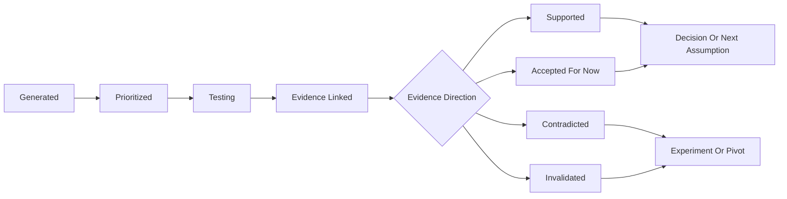

# Assumption Risk Analysis

## Purpose

This document defines how the product identifies, scores, ranks, and acts on startup assumptions.

The assumption engine should answer:

* What beliefs does this company depend on?
* Which beliefs are least validated?
* Which beliefs would most damage the company if false?
* Which assumption should the founder test next?
* What experiment would create the strongest evidence fastest?

The goal is not to create a long list of strategic concerns.

The goal is to identify the few assumptions blocking progress toward first revenue.

---

## Core Principle

Every early company is a stack of unproven beliefs.

The product should continuously turn this stack:

```text
I think this customer has this problem.
I think they care enough to act.
I think they will pay.
I think I can reach them.
I think I can build the first useful version.
```

Into this operating question:

```text
What is the riskiest belief we can test this week?
```

---

## Assumption Lifecycle



---

## Assumption Categories

### Customer

Beliefs about who has the problem.

Examples:

* Middle school teachers are the right first customer.
* Solo founders are willing to use an AI operating system.
* Local HVAC companies struggle with follow-up.

### Problem

Beliefs about pain, urgency, and frequency.

Examples:

* The problem happens weekly.
* The problem is painful enough to seek a solution.
* Existing alternatives are frustrating.

### Solution

Beliefs about whether the proposed product solves the problem.

Examples:

* A lightweight dashboard is enough for the first version.
* Users trust AI-generated grading feedback.
* Customers prefer automation over templates.

### Willingness To Pay

Beliefs about whether customers will pay and how much.

Examples:

* Teachers will personally pay $15/month.
* Founders will pay before they earn revenue.
* Agencies will pay per client workspace.

### Buyer And Sales

Beliefs about who can buy and how the sale happens.

Examples:

* The user is also the buyer.
* A founder can close customers through direct outreach.
* School district approval is not required for a pilot.

### Distribution

Beliefs about how customers can be reached.

Examples:

* Cold email can generate qualified conversations.
* Founder communities are a viable acquisition channel.
* TikTok content can reach the target customer.

### Market

Beliefs about size, timing, competition, and alternatives.

Examples:

* The market is large enough for a meaningful business.
* Competitors are document generators, not operating systems.
* Customers are actively looking for a better workflow.

### Technical

Beliefs about feasibility, reliability, integrations, or quality.

Examples:

* The MVP can be built without custom model training.
* Existing APIs can support the core workflow.
* The product can produce accurate enough summaries.

### Regulatory And Trust

Beliefs about compliance, data sensitivity, and adoption barriers.

Examples:

* The product can avoid storing sensitive student data.
* Users will trust AI recommendations for business decisions.
* No formal approval is needed before a small pilot.

### Operational

Beliefs about delivery, support, fulfillment, or service complexity.

Examples:

* The founder can manually deliver the first version.
* The workflow does not require heavy customer onboarding.
* Support burden will be manageable for early users.

---

## Risk Scoring Model

Each assumption should receive a risk score.

The score should combine:

* importance
* uncertainty
* evidence weakness
* revenue impact
* dependency level
* urgency

### Suggested Fields

```text
importance: 1-5
uncertainty: 1-5
evidence_strength: 0-5
revenue_impact: 1-5
dependency_level: 1-5
urgency: 1-5
risk_score: computed
```

### Field Meaning

#### Importance

How essential is this assumption to the company?

* 1: minor
* 2: useful
* 3: meaningful
* 4: important
* 5: existential

#### Uncertainty

How unknown is it?

* 1: strongly known
* 2: somewhat known
* 3: unclear
* 4: doubtful
* 5: unknown

#### Evidence Strength

How much strong evidence supports it?

* 0: no evidence
* 1: vague opinions
* 2: stated interest
* 3: repeated pain or clear intent
* 4: concrete commitment
* 5: payment or repeated usage

#### Revenue Impact

How directly does this assumption affect first revenue?

* 1: little effect
* 2: indirect effect
* 3: meaningful effect
* 4: strong effect
* 5: blocks first dollar

#### Dependency Level

How many other assumptions depend on this being true?

* 1: isolated
* 2: few dependencies
* 3: moderate dependencies
* 4: many dependencies
* 5: foundation assumption

#### Urgency

How soon does this need to be resolved?

* 1: later
* 2: soon
* 3: this month
* 4: this week
* 5: now

### Example Formula

```text
risk_score =
  importance * 0.25 +
  uncertainty * 0.20 +
  (5 - evidence_strength) * 0.20 +
  revenue_impact * 0.20 +
  dependency_level * 0.10 +
  urgency * 0.05
```

This produces a score from 1 to 5.

The exact weights can change later, but the MVP should bias toward assumptions that block first revenue.

---

## LLM Role In Risk Analysis

The LLM can help by drafting and explaining scores.

### LLM Can Infer

The LLM can infer:

* likely assumption category
* importance
* uncertainty
* revenue impact
* dependency level
* urgency
* likely regulatory or trust risk
* experiment ideas
* why an assumption matters

### LLM Should Not Pretend To Know

The LLM should not invent:

* customer behavior
* actual evidence
* payment willingness
* compliance status
* market demand
* user authority to buy
* technical feasibility proof

### Founder Confirmation Needed

Founder should confirm:

* assumptions ranked as top priority
* assumptions marked high confidence
* assumptions that affect pricing
* assumptions that affect customer or buyer definition
* assumptions with regulatory implications
* assumptions that cause a pivot recommendation

---

## Evidence Adjustment

Evidence should automatically affect assumption risk.

### Evidence Direction

Each evidence link has:

* relationship: supports, contradicts, mixed, neutral
* strength: weak, moderate, strong
* behavior_type: opinion, stated_intent, behavior, payment

### Risk Effects

Supporting evidence should:

* increase confidence
* reduce uncertainty
* reduce evidence weakness

Contradicting evidence should:

* reduce confidence
* increase urgency
* potentially increase risk score

Payment evidence should:

* heavily increase confidence
* reduce willingness-to-pay risk
* move validation stage forward

Vague praise should:

* be stored
* have low strength
* avoid increasing confidence much

### Evidence Strength Hierarchy

From strongest to weakest:

1. payment
2. repeated usage
3. signed commitment
4. scheduled pilot
5. repeated painful behavior
6. specific stated intent
7. general interest
8. compliments
9. vague encouragement

---

## Prioritization Rules

The product should not simply sort by raw risk score.

It should choose the next assumption using practical founder constraints.

### Prioritize

Prioritize assumptions that are:

* directly tied to first revenue
* high uncertainty
* weakly evidenced
* cheap to test
* blocking other work
* likely to change the roadmap
* testable this week

### Deprioritize

Deprioritize assumptions that are:

* interesting but not urgent
* hard to test right now
* disconnected from revenue
* already supported by strong evidence
* better tested after a simpler assumption

### Example

If these assumptions exist:

1. Teachers will pay $15/month.
2. AI can generate perfect grading rubrics.
3. Teachers want a dashboard with analytics.

The product should likely prioritize:

```text
Teachers will pay $15/month.
```

Why:

* directly tied to first revenue
* can be tested through a paid pilot before building
* invalidation would change the whole business model

---

## Assumption-To-Experiment Mapping

Each risky assumption should map to a validation experiment.

### Customer Assumptions

Best tests:

* interviews
* niche outreach
* waitlist segmentation
* customer discovery calls

Strong evidence:

* repeated pattern across target customers
* willingness to schedule follow-up
* customer intros

### Problem Assumptions

Best tests:

* customer interviews
* workflow observation
* problem diary
* manual audit

Strong evidence:

* frequent pain
* existing workaround
* current spend
* measurable time or money loss

### Solution Assumptions

Best tests:

* prototype demo
* concierge MVP
* fake-door test
* usability test

Strong evidence:

* customer asks to use it again
* customer changes workflow
* customer invites teammate

### Willingness-To-Pay Assumptions

Best tests:

* paid pilot
* pre-order
* deposit
* pricing page test
* proposal with a real price

Strong evidence:

* payment
* signed agreement
* purchase order
* budget discussion with buyer

### Sales Assumptions

Best tests:

* outbound sequence
* warm intro campaign
* founder-led demo
* direct offer

Strong evidence:

* reply rate
* booked calls
* closed pilots
* sales cycle data

### Distribution Assumptions

Best tests:

* channel post
* content test
* community offer
* partnership outreach
* landing page traffic test

Strong evidence:

* qualified traffic
* conversion
* repeatable acquisition
* low-cost leads

### Technical Assumptions

Best tests:

* spike
* prototype
* API integration test
* manual simulation
* quality benchmark

Strong evidence:

* working prototype
* reliable result quality
* acceptable cost or latency

### Regulatory And Trust Assumptions

Best tests:

* compliance review
* customer approval process research
* privacy-safe workflow design
* buyer conversation about adoption constraints

Strong evidence:

* approved pilot path
* documented compliance requirement
* customer confirms acceptable data workflow

---

## Risk Analysis Output

The product should generate a concise risk analysis.

### Recommended Format

```text
Top Risk:
Teachers will personally pay $15/month for grading automation.

Why It Matters:
This blocks first revenue and determines whether the buyer can be an individual teacher instead of a school district.

Current Evidence:
Three teachers confirmed grading is painful, but none have agreed to pay.

Risk Score:
4.6 / 5

Recommended Test:
Offer five teachers a paid pilot at $15/month.

Success Metric:
Three teachers agree to pay or start a paid pilot.

Next Task:
Send paid pilot offer to five teachers by Friday.
```

---

## Data Model Additions

The `assumptions` table should include:

```text
importance
uncertainty
evidence_strength
revenue_impact
dependency_level
urgency
risk_score
testability
recommended_test_type
```

The `assumption_evidence` table should include:

```text
relationship
strength
behavior_type
confidence_delta
explanation
```

The `recommendations` table should include:

```text
related_assumption_id
risk_snapshot
recommended_experiment_id
recommended_task_id
```

---

## MVP Risk Engine

For the first version:

1. Generate 8 to 12 assumptions from project profile.
2. Classify each by category.
3. Score each using the 1 to 5 risk fields.
4. Ask founder to confirm or adjust the top 3.
5. Recommend one assumption to test.
6. Generate one experiment for that assumption.
7. Generate 1 to 3 tasks for the experiment.
8. Update risk after evidence is added.

The product should avoid presenting the founder with a spreadsheet of anxiety.

Show the full analysis if requested, but default to:

* top risk
* why it matters
* current evidence
* recommended test
* next action

---

## Example Risk Scores

### Assumption 1

```json
{
  "statement": "Teachers will personally pay $15/month for automated grading summaries.",
  "category": "willingness_to_pay",
  "importance": 5,
  "uncertainty": 5,
  "evidence_strength": 1,
  "revenue_impact": 5,
  "dependency_level": 5,
  "urgency": 5,
  "risk_score": 4.8,
  "recommended_test_type": "paid_pilot"
}
```

### Assumption 2

```json
{
  "statement": "Teachers experience grading as a frequent and painful problem.",
  "category": "problem",
  "importance": 5,
  "uncertainty": 2,
  "evidence_strength": 3,
  "revenue_impact": 4,
  "dependency_level": 5,
  "urgency": 3,
  "risk_score": 3.4,
  "recommended_test_type": "customer_interviews"
}
```

### Assumption 3

```json
{
  "statement": "A web app is the right delivery model for the first version.",
  "category": "solution",
  "importance": 3,
  "uncertainty": 3,
  "evidence_strength": 1,
  "revenue_impact": 2,
  "dependency_level": 2,
  "urgency": 2,
  "risk_score": 2.9,
  "recommended_test_type": "prototype_demo"
}
```

The first assumption should be prioritized because it most directly blocks first revenue.
