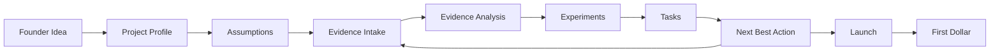

# AI Cofounder Pipeline

## Purpose

This document turns the product vision in `README.md` into a buildable pipeline.

The goal is to help a founder move from idea to first dollar through one repeatable loop:

**Idea -> structured company memory -> critical assumptions -> evidence -> experiments -> prioritized tasks -> next best action.**

The core principle stays simple:

**The database remembers. The LLM reasons. The founder decides.**

---

## Product Loop

The MVP should support one complete founder journey.

1. Founder enters an idea.
2. AI creates a structured project profile.
3. AI identifies critical assumptions.
4. Founder collects customer evidence.
5. AI summarizes evidence and connects it to assumptions.
6. AI creates validation experiments.
7. AI recommends the highest-impact next task.
8. Founder launches a simple offer.
9. Founder records first revenue.

Everything else should be layered on after this loop works end to end.

---

## Pipeline Overview

---

## Stage 1: Idea Intake

### Goal

Convert a raw founder idea into a structured company profile.

### Founder Input

The founder can describe:

* idea
* customer
* problem
* proposed solution
* pricing guess
* market or industry
* current progress

### AI Output

The AI should extract:

* target customer
* painful problem
* current alternatives
* proposed solution
* value proposition
* pricing hypothesis
* revenue model
* distribution hypothesis
* validation status

### Backend Writes

Create:

* project
* initial assumptions
* initial decisions
* onboarding event

### MVP Acceptance Criteria

The founder can enter an idea and receive a structured company snapshot that is saved to the database.

---

## Stage 2: Structured Company Memory

### Goal

Make the database the source of truth for the company.

### Core Tables

#### projects

Stores the top-level company profile.

Suggested fields:

* id
* user_id
* name
* description
* target_customer
* problem
* solution
* value_proposition
* revenue_model
* pricing_hypothesis
* stage
* created_at
* updated_at

#### decisions

Stores founder-approved choices.

Suggested fields:

* id
* project_id
* title
* decision
* reason
* status
* decided_at
* created_at
* updated_at

#### assumptions

Stores uncertain beliefs that need validation.

Suggested fields:

* id
* project_id
* statement
* category
* priority
* confidence
* status
* created_at
* updated_at

Categories:

* customer
* problem
* solution
* pricing
* distribution
* competition
* technical

Statuses:

* untested
* testing
* supported
* contradicted
* invalidated

#### evidence

Stores structured evidence gathered from the market.

Suggested fields:

* id
* project_id
* source_type
* source_title
* summary
* raw_text_id
* sentiment
* strength
* created_at
* updated_at

Source types:

* interview
* survey
* landing_page
* sales_call
* research
* document
* manual_note

#### assumption_evidence

Joins evidence to assumptions.

Suggested fields:

* id
* assumption_id
* evidence_id
* relationship
* explanation
* created_at

Relationships:

* supports
* contradicts
* neutral

#### experiments

Stores validation tests.

Suggested fields:

* id
* project_id
* assumption_id
* title
* hypothesis
* method
* success_metric
* status
* due_at
* created_at
* updated_at

Statuses:

* proposed
* running
* completed
* paused
* failed

#### tasks

Stores recommended and founder-created work.

Suggested fields:

* id
* project_id
* experiment_id
* title
* description
* priority
* expected_impact
* estimated_minutes
* status
* due_at
* created_at
* updated_at

Statuses:

* todo
* doing
* done
* skipped

#### artifacts

Stores generated or uploaded assets.

Suggested fields:

* id
* project_id
* type
* title
* content
* metadata
* created_at
* updated_at

Artifact types:

* landing_page_copy
* cold_email
* interview_script
* roadmap
* pricing_page
* launch_plan

#### events

Stores a timeline of important activity.

Suggested fields:

* id
* project_id
* actor
* event_type
* payload
* created_at

Actors:

* founder
* ai
* system

---

## Stage 3: Semantic Memory

### Goal

Store long-form and messy inputs for retrieval, while keeping structured facts in Postgres.

### Stored In Vector Search

Use vector search for:

* interview transcripts
* call notes
* uploaded documents
* market research
* brainstorming sessions
* competitor notes

### Recommended MVP Approach

Use Postgres with `pgvector` so structured memory and semantic memory live in one database.

Suggested table:

#### documents

* id
* project_id
* title
* source_type
* raw_text
* embedding
* metadata
* created_at

### Retrieval Rule

Every LLM request should receive only the context needed for the specific job.

Examples:

* next task recommendation: assumptions, experiments, evidence, open tasks
* cold email generation: customer, problem, value proposition, evidence, pricing
* roadmap generation: solution, feature requests, assumptions, validation evidence
* interview summary: transcript, current assumptions, customer profile

---

## Stage 4: AI Tool Layer

### Goal

The AI should propose actions, but the backend should validate and execute them.

### MVP Tools

Expose these application tools to the LLM:

* create_decision
* update_decision
* create_assumption
* update_assumption
* create_evidence
* link_evidence_to_assumption
* create_experiment
* update_experiment
* create_task
* update_task
* create_artifact
* search_project_context
* recommend_next_action

### Tooling Principle

The LLM does not directly mutate arbitrary state.

Instead:

1. Backend assembles relevant context.
2. LLM reasons and proposes tool calls.
3. Backend validates arguments.
4. Backend writes to the database.
5. Backend logs an event.
6. UI shows the founder what changed.

---

## Stage 5: Recommendation Engine

### Goal

Every session should answer:

**What is the most important thing this founder should do next?**

### Inputs

Use:

* current project stage
* open assumptions
* evidence strength
* active experiments
* incomplete tasks
* recent events
* founder goals

### Ranking Factors

Prioritize tasks by:

* impact on first revenue
* risk reduction
* urgency
* founder effort
* dependency unlocks
* confidence from evidence

### Output

The recommendation should include:

* one primary task
* why it matters
* what assumption it tests
* expected impact
* estimated time
* suggested script or artifact if useful

Example:

> Your riskiest assumption is that teachers will pay $15/month. You have three interviews showing grading pain, but no payment evidence. Your next task is to ask five teachers for a paid pilot by Friday.

---

## Stage 6: Founder Dashboard

### Goal

Give the founder a persistent operating view, not just a chat box.

### MVP Views

#### Today

Shows:

* next best action
* active experiment
* top risky assumption
* recently added evidence
* open tasks

#### Company Memory

Shows:

* customer
* problem
* solution
* pricing
* decisions
* assumptions

#### Evidence

Shows:

* interviews
* research
* notes
* linked assumptions
* strength of evidence

#### Experiments

Shows:

* active validation tests
* success metrics
* status
* results

#### Artifacts

Shows:

* interview scripts
* landing page copy
* cold emails
* launch plans

---

## Suggested Tech Stack

### Application

* Next.js for frontend and API routes
* TypeScript
* Tailwind CSS

### Database

* Supabase Postgres or Neon Postgres
* `pgvector` for semantic search

### Auth

* Supabase Auth or Clerk

### AI

* OpenAI API
* tool/function calling
* project-context retrieval layer

### Payments

* Stripe, after the validation loop works

### Background Jobs

Later:

* scheduled reminders
* interview processing
* periodic recommendations
* weekly founder summary

---

## Build Milestones

### Milestone 1: Static Product Skeleton

Goal:

Create a believable, clickable version of the product using local mock data.

This milestone should prove the product shape before adding persistence, authentication, or AI.

The founder should be able to open the app and immediately understand:

* what their company currently is
* what is still risky
* what evidence has been collected
* what experiment is active
* what they should do next

No AI or database is required yet.

#### Product Principles

* Dashboard-first, not chat-first.
* Show one primary next action, not a list of generic suggestions.
* Treat company memory as structured state, not generated documents.
* Make assumptions and evidence visible as first-class objects.
* Keep every screen focused on progress toward first revenue.

#### Mock Data

Use one realistic sample project, such as the teacher grading example used throughout the docs.

Include mock records for:

* project profile
* decisions
* assumptions
* evidence
* assumption-evidence links
* experiments
* tasks
* recommendations
* events

The mock data should be shaped like the future database records so the UI can later swap local data for API data with minimal redesign.

#### Core Screens

##### Today

Purpose:

Show the founder the current operating state.

Include:

* next best action card
* active experiment summary
* top risky assumption
* recent evidence
* open tasks
* progress toward first revenue

The next best action card should include:

* task title
* why it matters
* related assumption
* expected impact
* estimated time
* primary call to action

##### Idea Intake

Purpose:

Capture the founder's raw idea and preview the structured profile the product will create later.

Include:

* plain-language idea input
* optional fields for customer, problem, solution, pricing, progress, and goal
* static generated preview using mock extraction
* confirmation state for important fields

This screen does not need real AI. It can show a hardcoded example of what the AI will eventually produce.

##### Company Memory

Purpose:

Show the structured company snapshot.

Include:

* core identity
* customer and buyer
* problem
* solution
* business model
* sales motion
* validation state
* active decisions

Important fields should visually distinguish:

* user-provided
* llm-inferred
* user-confirmed

##### Assumptions

Purpose:

Show what the company currently believes and what needs validation.

Include:

* assumption list
* category
* status
* priority
* confidence
* risk score
* revenue blocker flag
* related evidence count

The view should make it obvious which assumption is riskiest and why.

##### Evidence

Purpose:

Show market learning and how it connects to assumptions.

Include:

* evidence inbox
* source type
* summary
* strength
* behavior vs opinion indicator
* linked assumptions
* relationship to each assumption

Include a static evidence intake form for pasted interview notes or manual observations.

##### Experiments

Purpose:

Show validation tests that turn assumptions into learning.

Include:

* active experiment
* proposed experiments
* completed experiments
* hypothesis
* method
* success metric
* due date
* related assumption
* result summary when present

##### Tasks

Purpose:

Show concrete founder work.

Include:

* task list
* status
* priority
* expected impact
* estimated minutes
* related assumption
* related experiment
* first revenue relevance

Tasks should be filterable or grouped by:

* today
* upcoming
* done
* blocked

#### Minimum Interactions

The static skeleton should support local UI-only interactions:

* switch between main views
* mark a task as done
* accept, dismiss, or snooze a recommendation
* edit a project memory field
* confirm an inferred field
* select the riskiest assumption
* add a draft evidence note
* start a proposed experiment

These interactions can update in-memory state only.

#### Suggested Routes

* `/` or `/today`
* `/intake`
* `/memory`
* `/assumptions`
* `/evidence`
* `/experiments`
* `/tasks`

#### Components To Create

* app shell
* sidebar or top navigation
* project switcher placeholder
* next action card
* project profile panel
* memory field row
* confirmation badge
* assumption card or table row
* evidence card
* experiment card
* task row
* event timeline item
* empty state

#### Non-Goals

Do not build yet:

* authentication
* database persistence
* AI extraction
* AI recommendations
* vector search
* billing
* notifications
* integrations
* file upload
* multi-project support beyond a placeholder

#### Acceptance Criteria

Milestone 1 is complete when:

1. A founder can navigate the main product views.
2. The dashboard clearly shows one recommended next action.
3. The company memory view shows structured project state.
4. The assumptions view highlights the riskiest assumptions.
5. The evidence view shows evidence linked to assumptions.
6. The experiments view shows at least one active validation test.
7. The tasks view shows concrete work tied to first revenue.
8. UI interactions work locally without a backend.
9. The mock data mirrors the planned database model.
10. The product feels like an operating dashboard, not a document generator.

### Milestone 2: Database-Backed Memory

Build the persistent company memory layer.

#### Goal

Move the core product state from mock data into Postgres so the app can create, update, and retrieve company memory as the single source of truth.

#### Build

* Postgres schema
* database migration flow
* project CRUD
* assumptions CRUD
* evidence CRUD
* experiments CRUD
* tasks CRUD
* event log
* relationship tables for links between assumptions, evidence, experiments, and tasks
* server-side validation for all writes
* basic audit timestamps on every record

#### Core Tables

#### projects

Store the top-level company profile and current validation state.

Fields:

* id
* user_id
* name
* short_description
* long_description
* stage
* status
* target_customer
* problem_statement
* solution_summary
* revenue_model
* pricing_hypothesis
* validation_stage
* project_memory_summary
* founder_goal
* founder_constraints
* created_at
* updated_at

#### assumptions

Store beliefs that still need to be proven, disproven, or refined.

Fields:

* id
* project_id
* statement
* category
* subcategory
* status
* priority
* confidence
* source
* owner
* importance
* uncertainty
* risk_score
* revenue_blocker
* created_at
* updated_at

#### evidence

Store customer and market signals that support or challenge assumptions.

Fields:

* id
* project_id
* source_type
* source_title
* summary
* raw_text
* source_date
* source_person_name
* source_company
* strength
* confidence
* specificity
* recency
* bias_risk
* willingness_to_pay_signal
* behavior_vs_opinion
* created_at
* updated_at

#### experiments

Store validation tests that are designed to prove or disprove assumptions.

Fields:

* id
* project_id
* assumption_id
* title
* hypothesis
* test_design
* success_metric
* success_threshold
* status
* expected_duration
* owner
* started_at
* completed_at
* created_at
* updated_at

#### tasks

Store concrete work items tied to validation, launch, and first revenue.

Fields:

* id
* project_id
* experiment_id
* assumption_id
* title
* description
* priority
* status
* due_date
* estimated_minutes
* impact_level
* effort_level
* source
* created_at
* updated_at

#### event_log

Store the chronological record of meaningful changes to company memory.

Fields:

* id
* project_id
* actor_type
* actor_id
* event_type
* entity_type
* entity_id
* summary
* payload
* created_at

#### Relationship Tables

Add join tables so the product can answer questions like "what evidence supports this assumption?" and "what task came from this experiment?"

* assumption_evidence
* assumption_experiment
* evidence_experiment
* task_experiment
* task_assumption

#### Backend Behavior

* Each create/update/delete operation writes through the API layer, not directly from the client.
* Every write should emit an event log entry.
* Reads should be scoped to a single project.
* The UI should be able to load the full memory graph from the database without relying on mock data.
* Validation should prevent partial or malformed memory records from being saved.

#### Non-Goals

Do not build yet:

* AI extraction
* AI recommendations
* evidence summarization
* experiment generation
* vector search
* notifications
* file uploads
* multi-tenant admin tooling

#### Acceptance Criteria

Milestone 2 is complete when:

1. A project can be created, read, updated, and deleted in Postgres.
2. Assumptions, evidence, experiments, and tasks can each be CRUDed through the backend.
3. Relationship tables preserve links between memory objects.
4. Every mutation is recorded in the event log.
5. The frontend can load live data from the database.
6. The schema matches the core product model in `DATA_MODEL.md`.
7. Invalid writes are rejected before they reach persistent storage.
8. The product no longer depends on mock data for core memory state.

### Milestone 3: AI Onboarding

Build:

* idea-to-profile extraction
* initial assumption generation
* initial task generation
* founder confirmation before saving important decisions

#### Acceptance Criteria

Milestone 3 is complete when:

1. A founder can submit a plain-language description of their idea through the product.
2. The system converts that description into a structured draft company profile, including the problem, target customer, solution, business model, and current stage when those details are available.
3. Missing, ambiguous, or low-confidence profile fields are explicitly identified rather than presented as established facts.
4. The system generates an initial set of assumptions that covers at least customer, problem, solution, distribution, and willingness-to-pay risk where relevant to the idea.
5. Each generated assumption includes a clear statement, category, risk level, and an initial status of untested unless the founder provides supporting evidence.
6. The system generates an initial, prioritized set of concrete tasks that help validate the highest-risk assumptions and move the founder toward a first customer or first dollar.
7. Generated tasks include enough context to act on them: a title, rationale, linked assumption or goal, and a clear next step.
8. The founder can review, edit, accept, or reject every generated profile field, assumption, and task before it becomes part of company memory.
9. No AI-generated profile decision, assumption, or task is persisted until the founder explicitly confirms it; rejected items are not saved.
10. Confirmed onboarding outputs are saved through the Milestone 2 persistence layer, retain their relationships, and appear correctly in the dashboard, company memory, assumptions, and tasks views after a refresh.
11. The onboarding flow handles incomplete or poor-quality input gracefully by asking targeted follow-up questions or producing an editable partial draft without inventing unsupported details.
12. A founder who completes onboarding leaves with a usable project profile, a prioritized risk list, and a short list of next actions without needing to understand the underlying data model.

### Milestone 4: Evidence Intake

Build:

* paste interview notes
* summarize evidence
* link evidence to assumptions
* update assumption confidence/status

### Milestone 5: Experiment Engine

Build:

* generate experiments from assumptions
* create experiment tasks
* track experiment results
* mark assumptions supported or contradicted

### Milestone 6: Next Best Action

Build:

* recommendation endpoint
* task ranking
* dashboard recommendation card
* explanation for why the task matters

### Milestone 7: Artifact Generation

Build:

* interview script generator
* cold email generator
* landing page copy generator
* launch checklist generator

---

## MVP Product Contract

The MVP is successful when a founder can:

1. Enter a startup idea.
2. Receive a structured company profile.
3. See the riskiest assumptions.
4. Add customer interview notes.
5. See evidence connected to assumptions.
6. Create a validation experiment.
7. Receive one clear next best action.
8. Track progress toward first revenue.

---

## Open Product Questions

* Is the first target user a solo founder, student founder, indie hacker, or small startup team?
* Should the first vertical be general-purpose, SaaS, education, local services, or ecommerce?
* Is the core UX chat-first, dashboard-first, or hybrid?
* Should the app optimize for first dollar, first customer interview, or first paid pilot?
* How much authority should the AI have to update memory without founder approval?
* What evidence threshold changes an assumption from untested to supported?
* Should recommendations be deterministic, AI-generated, or a hybrid ranking system?

---

## Immediate Next Step

Build Milestone 1 as a local product skeleton:

* dashboard-first app
* idea intake form
* project profile panel
* assumption tracker
* evidence inbox
* experiment board
* next action panel

This gives us something concrete to refine before connecting the database and AI layer.
