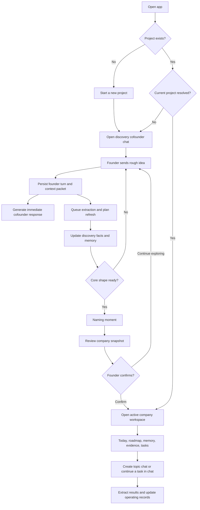

# First Dollar — Current Project State and MVP Status

**As of:** 2026-08-10  
**Repository:** `dollardollar`  
**Current product position:** Technical alpha foundation; not yet ready for an external MVP cohort.

## Executive status

First Dollar is a database-backed AI cofounder workspace intended to help a founder move from a rough startup idea to a first-dollar operating plan.

The project has moved beyond a static intake form. The core system now supports:

- Project-scoped conversation history
- Database-derived AI context packets
- Precomputed follow-up plans
- Background enrichment jobs
- Discovery facts and canonical memory items
- Confidence and provenance metadata
- A natural checkpoint and naming flow
- Four visible roadmap slots backed by a deeper graph foundation
- Topic chats sharing company memory
- Founder review of material AI-generated changes

The MVP is not complete because the most differentiated product behavior—turning recommendations into guided, trustworthy execution—is still shallow. The current application can demonstrate the core loop, but it does not yet reliably prove that a founder can reach first dollar with the product.

## MVP verdict

| Dimension | Status | Meaning |
|---|---|---|
| Core discovery conversation | **Working** | A founder can start a project and discuss an idea with a cofounder-style chat |
| Database-backed context | **Working** | Chat context is assembled from persisted project memory and operational records |
| Fast response versus enrichment separation | **Mostly working** | Founder and assistant turns persist before enrichment; the visible response still waits for the model call |
| Checkpoint and snapshot review | **Working with edge cases** | Readiness, naming, review, and confirmation exist; the naming transition is not fully seamless |
| Company memory | **Partially working** | Canonical memory records and provenance exist; correction, contradiction, and stale-state UX are incomplete |
| First-dollar roadmap | **Partially working** | Four visible milestones and graph storage exist; selection and dependency semantics are incomplete |
| Continued topic chat | **Working foundation** | Multiple sessions share project context, but linked execution context is limited |
| Guided execution | **Early prototype** | Tasks and experiments can continue in chat; templates, artifacts, research, and approvals are missing |
| Analytics and outcome measurement | **Not implemented** | Automated tests exist, but product behavior is not instrumented |
| Production authentication | **Not implemented** | The server currently uses an `x-user-id` header with a local fallback |

### Recommended MVP label

The product is suitable for:

- Internal dogfooding
- Founder interviews and usability sessions
- Testing the discovery-to-checkpoint flow
- Validating the memory and recommendation concepts

The product is not yet suitable for:

- A broad public launch
- Claiming reliable first-dollar execution support
- Trusting automatic completion updates without review
- Measuring product-market fit or cohort outcomes

## Current user flows

### Flow 1: First project and discovery

1. The user opens the app.
2. If no project exists, the empty state offers **Start a conversation**.
3. The server creates a project in `discovery` onboarding state.
4. The Cofounder view becomes the primary screen.
5. The founder writes a rough idea in the chat composer.
6. The server persists the founder turn and builds a context packet from database memory.
7. The cofounder responds using the current conversation plan and inferred hidden mode.
8. A background job extracts discovery facts and replenishes the recommendation plan.
9. The learning panel shows a working picture of the customer, problem, solution, and extracted facts.

Current experience: usable for a technical demo, but response latency, extraction freshness, and recovery behavior need product-level measurement.

### Flow 2: Discovery questions and recommendation planning

The discovery planner tracks these fields:

- Customer segment
- Problem
- Context
- Current workaround
- Desired outcome
- Solution
- Buyer
- First-dollar offer

The planner ranks missing or low-confidence fields and creates several planned items. The cofounder can reflect, ask a question, or introduce the naming checkpoint. Plan items have durable ordering and statuses including `pending`, `consumed`, `skipped`, and `expired`.

Current experience: the architecture supports the intended flow, but there is not yet enough end-to-end testing to prove that a founder message consistently consumes or skips the right planned item.

### Flow 3: Checkpoint, naming, and company activation

When the core discovery fields reach sufficient confidence:

1. The system marks checkpoint readiness.
2. The cofounder can introduce the idea of giving the company an identity.
3. The founder can use or edit an AI naming suggestion.
4. The snapshot review page displays profile fields and open gaps.
5. AI-organized fields appear in red and require either **Looks good** or an edit.
6. The confirmation button stays disabled while required fields are empty.
7. Confirming the snapshot updates the project to active and promotes the profile into company memory.

Current experience: the review gate is clear and safe. The remaining issue is continuity: naming is still partly a page transition instead of a rich brainstorming exchange inside the same chat.

### Flow 4: Active company workspace

After confirmation, the main navigation exposes:

- Today
- First-dollar roadmap
- Company memory
- Assumptions
- Evidence
- Experiments
- Tasks
- Cofounder chat

The Today view surfaces a recommendation, an active experiment, open tasks, recent activity, and progress toward first revenue.

Current experience: the workspace is navigable and records are connected, but the operating loop is still more dashboard-like than cofounder-led.

### Flow 5: Company memory

The canonical memory layer stores each extracted item with:

- Aspect
- Statement or structured value
- Classification
- Confidence
- Evidence status
- Review state
- Source turn IDs and document IDs
- Related entity IDs
- Current or superseded status

The UI groups items by aspect and displays classification, confidence, and review state. Historical source excerpts are hidden behind an expand control, while raw IDs are not shown to the user.

Current experience: good foundation for a trustworthy memory workspace. The user still needs direct correction, contradiction resolution, stale-claim handling, and review history.

### Flow 6: Roadmap and first dollar

The roadmap API exposes visible milestone nodes and hidden nodes. The current materializer creates up to four visible milestone slots and hidden nodes for assumptions, experiments, and tasks.

Current experience: the graph is present, but the roadmap does not yet fully implement the requested rule that visible milestones be selected deterministically by dependency order, first-dollar relevance, risk, effort, and unlock value. Evidence nodes and conditional software-build nodes are also incomplete.

### Flow 7: Continued topic chat and completion reporting

An active company can create topic chats such as customer interviews, product decisions, pricing, or product design. Each session has its own turns while sharing project-scoped memory.

Tasks can open the chat with a prefilled message such as:

> I completed this task: [task]. Here is what happened:

The background enrichment worker currently recognizes narrow task and experiment completion phrases and can update operational status.

Current experience: useful bridge from dashboard to chat, but not yet a full guided execution system. Completion detection needs structured intent, ambiguity handling, evidence creation, and review boundaries.

## MVP progress by phase

| Phase | Current progress | MVP assessment |
|---|---:|---|
| Phase 1 — Discovery conversation | 75% | The core conversation, persistence, planning, discovery extraction, and checkpoint readiness exist |
| Phase 2 — Intake and company memory | 65% | Snapshot synthesis, confidence, provenance, and memory grouping exist; memory correction and contradiction UX remain |
| Phase 3 — First-dollar roadmap | 55% | Four milestones and a dependency graph foundation exist; semantic selection and complete hidden work graph remain |
| Phase 4 — Continued cofounder and guided execution | 45% | Topic chats and basic completion reporting exist; guided artifacts and research workflows are missing |
| Cross-cutting reliability and analytics | 40% | Retry-safe jobs and recovery exist; latency, funnel, model-quality, and outcome analytics do not |
| **Overall MVP progress** | **60–65%** | Strong technical alpha; incomplete differentiated product loop |

## Capability status matrix

### Green — working enough for internal validation

- Project creation through the cofounder entry point
- Project-level ownership checks in API routes
- Blocking creation of a second unresolved project at both UI and server layers
- Persisted founder and assistant conversation turns
- Database-derived context packets
- Deterministic recommendation ranking
- Durable plan-item statuses
- Background job retry state and idempotency keys
- Discovery fact extraction and confidence classification
- Checkpoint readiness based on core discovery fields
- Snapshot confirmation and project activation
- Founder-controlled company name persistence
- Topic session creation and project-scoped shared memory
- Four visible roadmap slots
- Full automated test suite passing

### Yellow — present but incomplete or fragile

- Fast response path: extraction is asynchronous, but the model response is still synchronous
- Name request to snapshot transition
- Recovery after deleted or incomplete database context
- AI-organized field review state
- Canonical memory correction and supersession
- Historical provenance navigation
- Recommendation queue consumption and skipping
- Roadmap graph semantics and progress derivation
- Completion parsing for tasks and experiments
- Cross-topic chat isolation and linked context
- Evidence updates from completion reports

### Red — not yet an MVP capability

- Structured guided execution workspace
- Research results with sources and founder approval
- Interview scripts and outreach templates generated from task context
- Product decision frameworks and draft artifacts
- Conditional software-build roadmap nodes
- Ambiguity-safe completion state
- Contradiction and stale-memory resolution UI
- Product analytics and funnel dashboards
- Production-grade authentication and multi-user authorization

## Current technical architecture

### Client

- Single-page browser application using `app.js`, `styles.css`, and `overrides.css`
- Hash-based navigation
- Discovery mode gates the rest of the workspace until checkpoint confirmation
- Optimistic founder message rendering in chat
- Reviewable snapshot form with required-field activation gating

### Server

- Node HTTP server with JSON API routes
- Server-only OpenAI calls
- Project-scoped authorization using the current request user ID
- Conversation, recommendation, checkpoint, memory, roadmap, entity, and change-set endpoints
- Background job draining through the operating-loop service

### Database

The current migration set contains nine migrations covering:

- Company memory and operating records
- Industry and roadmap milestones
- Conversation sessions, context packets, turns, and recommendations
- Versioned beliefs
- AI change sets
- Deterministic recommendation history
- Project onboarding state
- Pre-snapshot discovery facts
- Durable plans, background jobs, canonical memory items, and roadmap graph nodes

### Trust model

The application distinguishes between:

- Founder-confirmed project data
- AI-organized discovery fields
- Working memory
- Material proposed records
- Approved and applied change sets

This is directionally correct for the intended lightweight-hybrid trust model. The missing part is extending that review discipline to memory corrections, evidence interpretations, completion reports, and generated artifacts.

## Reliability and recovery state

The project has addressed several failure modes raised during development:

| Failure mode | Current behavior |
|---|---|
| Extraction fails after a founder message | Founder and assistant conversation can remain persisted; enrichment is queued separately |
| Missing context packets for old turns | Recovery logic can recreate packets and requeue enrichment for discovery projects |
| Missing discovery facts but structured assistant history remains | Recovery can rebuild recoverable discovery facts from persisted assistant payloads |
| User tries to create another unresolved project | UI disables the action and the server returns a conflict |
| AI-organized checkpoint text is not reviewed | Red treatment and review action remain until the founder edits or confirms the field |
| Raw memory source IDs are confusing | Default memory UI hides IDs and historical source text behind expansion |

Recovery is not unlimited. If the underlying conversation turns and their structured payloads are both deleted, the system cannot reconstruct facts that no longer have a source.

## Known MVP risks

### Product risk: the cofounder may feel like a planner, not a partner

The prompt contract is warm and the planner has hidden modes, but the user experience still exposes recommendation-oriented surfaces. The product needs real conversation evaluation to confirm that the cofounder reflects interesting details, asks one useful question, and preserves emotional momentum.

### Trust risk: automatic updates can be too confident

Task and experiment completion recognition is based on narrow text patterns. A vague or ambiguous founder report can be interpreted as a completion without an explicit review state.

### Roadmap risk: graph storage may imply more intelligence than exists

The database stores nodes and edges, but the current selection logic is not yet a full dependency-aware planner. The visible roadmap should not be treated as authoritative until milestone selection and derived progress are deterministic and tested.

### Reliability risk: no user-facing processing model

The API returns background-processing status, but the UI does not yet make enrichment freshness, retries, or stale memory obvious enough to the founder.

### Security risk: current identity is development-grade

The server uses the `x-user-id` header and defaults to `local-founder`. This is useful for local testing but is not production authentication or authorization.

## Definition of an MVP-ready release

The project should be considered MVP-ready for a small founder cohort when all of the following are true:

### Required before cohort launch

- A founder can complete discovery, naming, snapshot review, and activation without manual database repair.
- The first response meets a documented latency target under normal conditions.
- Background enrichment failures are visible and retryable from the product.
- Memory items can be corrected, superseded, and traced back to a readable conversation source.
- The four visible roadmap milestones are generated from a tested hidden dependency graph.
- Task and experiment completion reports require structured confirmation when ambiguous.
- At least one guided execution flow is complete end to end, preferably customer interviews with an outreach template and result capture.
- The user identity model is safe for the intended cohort.
- Basic funnel and reliability events are stored.

### Useful but can follow the first cohort

- Multiple guided execution templates
- Prospect research integrations
- Artifact generation and editing
- Advanced contradiction visualization
- Full roadmap editing
- Rich cross-topic chat navigation
- Cohort dashboards and first-dollar benchmarking

## Recommended next build sequence

### Milestone 1 — Reliable founder loop

1. Instrument response latency, enrichment status, checkpoint transitions, plan-item consumption, and errors.
2. Add concurrent chat submission ordering tests.
3. Replace regex completion detection with structured completion intents and an explicit `pending_review` state.
4. Make naming a continuous chat flow with temporary suggestions and explicit selection.

### Milestone 2 — Trustworthy company memory

1. Add memory-item correction and supersession endpoints.
2. Add contradiction, stale, and unresolved-gap views.
3. Preserve provenance during edits and material changes through change sets.
4. Add recovery tests for deleted memory rows, deleted context packets, and deleted source turns.

### Milestone 3 — First-dollar execution MVP

1. Implement deterministic milestone selection.
2. Add evidence and conditional software-build nodes.
3. Derive visible progress from hidden nodes.
4. Ship one complete guided execution flow for customer interviews.
5. Require founder approval before material research or artifacts become company memory.

## Current verification

The latest full repository test run completed successfully:

- **79 tests passed**
- **0 tests failed**
- Database migrations 001 through 009 applied successfully
- JavaScript syntax checks passed for the application and server modules

Passing tests establish technical regressions are controlled. They do not yet establish that the product is pleasant, fast, or effective for founders; those require instrumented user sessions and qualitative evaluation.

## Bottom line

First Dollar is currently a credible internal alpha for testing the discovery-to-company-snapshot concept. The architecture supports the intended direction, and the core persistence boundaries are in place. The MVP is not finished because the product’s promise is not only to remember and recommend—it is to help a founder confidently perform the next piece of work.

The next release should prioritize reliability, trust, and one complete guided execution workflow over additional breadth.
