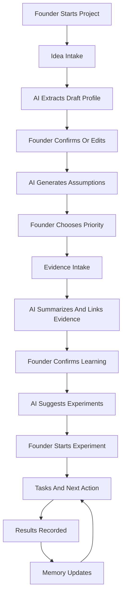

# User Use Pipeline

## Purpose

This document explains how a founder uses the product and how each step fills the core data model.

The key design question:

**What do we need from the founder, what can the LLM infer, and what should the founder confirm before it becomes company memory?**

The product should feel lightweight for the founder, but the database should become increasingly structured over time.

---

## Guiding Rule

Use three memory confidence levels:

* `user_provided`: the founder explicitly said it.
* `llm_inferred`: the AI inferred it from context.
* `user_confirmed`: the founder approved it as current company memory.

For important company state, the app should prefer `user_confirmed`.

Examples:

* A founder says, "I want to sell to teachers." This can be stored as `user_provided`.
* The LLM infers the industry is education. This should be stored as `llm_inferred`.
* The founder clicks confirm on "Target customer: middle school teachers." This becomes `user_confirmed`.

---

## Pipeline Overview



---

## 1. Project Start

### User Experience

The founder starts with a plain-language prompt:

> What are you building, who is it for, and what progress have you made so far?

### Data Structures Filled

* projects
* assumptions
* decisions
* events

### Founder Input Needed

Ask for:

* idea
* target customer
* problem
* proposed solution
* current progress
* goal

Optional:

* pricing guess
* industry
* competitors
* sales channel
* timeline
* constraints

### LLM Can Infer

The LLM can usually infer:

* industry
* sub_industry
* product_type
* delivery_model
* likely revenue_model
* likely sales_motion
* target_user vs target_buyer
* likely regulatory_risk_level
* likely technical_risk_level
* likely market_risk_level
* likely sales_risk_level
* initial validation_stage

### Founder Should Confirm

Require confirmation for:

* target_customer
* target_buyer
* problem_statement
* solution_summary
* pricing_hypothesis
* revenue_model
* sales_motion
* first_revenue_target

### Example

Founder says:

> I am building an AI tool that helps teachers grade homework faster. I have talked to three teachers and they all complained about grading taking too long.

LLM can infer:

```json
{
  "industry": "education",
  "sub_industry": "K-12",
  "product_type": "AI tool",
  "delivery_model": "web app",
  "target_customer": "teachers",
  "target_user": "teachers",
  "target_buyer": "individual teachers",
  "problem_statement": "Teachers spend too much time grading homework.",
  "validation_stage": "problem_validation",
  "regulatory_risk_level": "medium",
  "sales_motion": "founder-led sales"
}
```

Founder should confirm:

* Are individual teachers really the buyer?
* Is the first revenue goal a paid pilot, monthly subscription, or school purchase?
* Is grading speed the primary problem, or is feedback quality the deeper problem?

---

## 2. Project Profile Creation

### User Experience

The AI shows a draft company snapshot.

The founder can edit fields directly.

### Data Structures Filled

Primary:

* projects

Secondary:

* events
* decisions

### Project Fields

#### Core Identity

Ask user:

* name
* short_description
* founder_goal

Infer:

* tagline
* long_description
* stage

Confirm:

* name
* short_description
* stage

#### Market

Ask user:

* target_customer
* geographic_market
* known competitors

Infer:

* industry
* sub_industry
* customer_segment
* target_user
* target_buyer

Confirm:

* target_customer
* target_buyer
* industry

#### Problem

Ask user:

* problem_statement
* current alternatives
* urgency

Infer:

* problem_frequency
* problem_severity
* switching_pain

Confirm:

* problem_statement
* urgency_level

#### Solution

Ask user:

* solution_summary
* key features

Infer:

* product_type
* delivery_model
* primary_use_case
* differentiation

Confirm:

* product_type
* core_value_proposition

#### Business Model

Ask user:

* pricing_hypothesis
* preferred revenue model

Infer:

* pricing_unit
* expected_average_contract_value
* expected_gross_margin
* payment_timing

Confirm:

* revenue_model
* pricing_hypothesis

#### Sales And Distribution

Ask user:

* how they expect to find customers
* any existing audience or network

Infer:

* sales_motion
* primary_channel
* buyer_complexity
* sales_cycle_estimate
* acquisition_strategy

Confirm:

* sales_motion
* primary_channel

#### Risk Profile

Ask user:

* whether sensitive data is involved
* whether approvals, licenses, or compliance are needed
* whether the product handles money, health, children, education records, or legal decisions

Infer:

* regulatory_risk_level
* technical_risk_level
* market_risk_level
* sales_risk_level
* capital_intensity
* operational_complexity
* trust_requirement
* data_sensitivity

Confirm:

* regulatory_risk_level when medium or high
* data_sensitivity
* compliance_notes

---

## 3. Assumption Generation

### User Experience

After the profile is created, the AI says:

> These are the beliefs your company depends on. The riskiest ones should be tested first.

### Data Structures Filled

* assumptions
* events
* recommendations

### Founder Input Needed

The founder does not need to list assumptions manually.

They should answer:

* Which of these feels most uncertain?
* Which would kill the idea if false?
* What have you already learned?

### LLM Can Infer

The LLM can infer assumptions from:

* project fields
* industry
* product type
* revenue model
* sales motion
* regulatory risk
* founder goal

### Example Assumptions

For an education SaaS project:

* Teachers have this problem frequently.
* Teachers rank this problem above other urgent work.
* Teachers are allowed to use this tool at school.
* Teachers will pay personally.
* Schools do not need district-level approval before a pilot.
* Student data can be handled safely.
* A lightweight MVP is enough to test willingness to pay.

### Founder Should Confirm

Require founder confirmation for:

* top priority assumptions
* revenue-blocking assumptions
* regulatory assumptions
* assumptions marked high confidence

### Avoid

Do not treat LLM-generated assumptions as validated.

Default generated assumptions to:

```text
status: untested
source: ai_generated
confidence: low
```

---

## 4. Decision Capture

### User Experience

When a founder chooses direction, the app asks whether to save it as a decision.

Example:

> Should I remember that you are starting with individual teachers instead of school districts?

### Data Structures Filled

* decisions
* events
* projects

### Founder Input Needed

Founder must provide or confirm:

* the decision
* why it was made
* whether it is temporary or firm

### LLM Can Infer

The LLM can infer:

* decision_type
* related assumptions
* likely impact
* whether the decision appears reversible

### Founder Should Confirm

Always confirm decisions before they become active.

Decisions should usually be `user_confirmed`, not merely `llm_inferred`.

---

## 5. Evidence Intake

### User Experience

The founder adds messy real-world input:

* interview notes
* transcript
* sales call summary
* survey results
* landing page metrics
* competitor notes
* manual observation

### Data Structures Filled

* evidence
* assumption_evidence
* documents
* events

### Founder Input Needed

Ask for:

* source type
* who the evidence came from
* date
* raw notes or transcript
* whether the person is a target customer
* whether any payment behavior occurred

### LLM Can Infer

The LLM can infer:

* summary
* pain points
* objections
* feature requests
* current alternatives
* buying triggers
* price reactions
* evidence strength
* behavior_vs_opinion
* related assumptions
* whether evidence supports or contradicts each assumption

### Founder Should Confirm

Require confirmation for:

* evidence linked as strong support
* evidence linked as strong contradiction
* any update that changes assumption status
* any conclusion about willingness to pay

### Evidence Quality Rule

Payment behavior is stronger than stated interest.

Recommended evidence ranking:

1. paid customer
2. paid pilot
3. signed letter of intent
4. scheduled follow-up with clear buying intent
5. repeated painful behavior
6. stated interest
7. compliments
8. vague encouragement

---

## 6. Evidence-To-Assumption Linking

### User Experience

After evidence intake, the AI shows:

> This interview supports 2 assumptions, contradicts 1, and created 1 new question.

### Data Structures Filled

* assumption_evidence
* assumptions
* events

### Founder Input Needed

Founder should approve:

* support or contradiction links
* whether confidence should change
* whether a new assumption should be created

### LLM Can Infer

The LLM can infer:

* relationship
* strength
* explanation
* confidence change suggestion
* new assumption suggestions

### Founder Should Confirm

Confirm before:

* changing assumption status to supported
* changing assumption status to contradicted
* invalidating an assumption
* creating a major new assumption

---

## 7. Experiment Creation

### User Experience

The AI suggests a validation experiment for the riskiest assumption.

Example:

> To test whether teachers will pay $15/month, offer five teachers a paid pilot this week.

### Data Structures Filled

* experiments
* tasks
* recommendations
* events

### Founder Input Needed

Ask founder:

* target customer
* available time
* preferred channel
* success threshold
* deadline
* comfort with charging now

### LLM Can Infer

The LLM can infer:

* experiment title
* hypothesis
* method
* success metric
* sample size goal
* expected effort
* risk level
* related tasks

### Founder Should Confirm

Require confirmation for:

* success metric
* deadline
* whether the experiment asks for money
* who will be contacted

### Good Experiment Defaults

Prefer experiments that test behavior, not opinions.

Examples:

* Ask for payment.
* Ask for a scheduled pilot.
* Ask for a commitment.
* Ask for a referral.
* Measure conversion on a landing page.
* Run a concierge version manually.

---

## 8. Task Generation

### User Experience

The AI turns experiments into concrete tasks.

### Data Structures Filled

* tasks
* recommendations
* events

### Founder Input Needed

Ask for:

* available time
* preferred work style
* deadlines
* constraints

### LLM Can Infer

The LLM can infer:

* task title
* description
* task_type
* priority
* expected_impact
* estimated_minutes
* expected_learning
* first_revenue_relevance

### Founder Should Confirm

Require confirmation for:

* outreach tasks that use real customer names
* public launch tasks
* paid ad or spend tasks
* tasks involving legal, medical, financial, or regulated claims

---

## 9. Next Best Action

### User Experience

When the founder opens the app, they see one primary action.

The app should not overwhelm them with ten strategic options.

### Data Structures Read

* projects
* assumptions
* evidence
* experiments
* tasks
* decisions
* events

### Data Structures Filled

* recommendations
* events

### Founder Input Needed

Founder may provide:

* today available time
* energy level
* current blocker
* near-term goal

### LLM Can Infer

The LLM can infer:

* highest leverage task
* why it matters
* what assumption it tests
* what evidence is missing
* what artifact would help

### Founder Should Confirm

The founder should choose:

* accept
* dismiss
* snooze
* modify

### Recommendation Rule

The next action should usually prioritize:

1. first revenue
2. riskiest untested assumption
3. customer evidence
4. active experiment completion
5. removing execution blockers

---

## 10. Results And Learning

### User Experience

After a task or experiment, the founder records what happened.

Example:

> I emailed 10 teachers. 3 replied, 2 booked calls, 1 said she would pay $15/month if it saves two hours a week.

### Data Structures Filled

* evidence
* assumption_evidence
* experiments
* tasks
* decisions
* events
* projects

### Founder Input Needed

Ask for:

* what happened
* numbers
* customer quotes
* payment behavior
* objections
* next commitments

### LLM Can Infer

The LLM can infer:

* result summary
* conversion rate
* strength of evidence
* related assumptions
* updated confidence suggestions
* next experiment
* follow-up tasks

### Founder Should Confirm

Require confirmation before:

* changing project validation_stage
* marking an experiment completed
* changing assumption status
* recording first revenue
* creating a major decision

---

## What The LLM Can Safely Infer

The LLM can usually infer low-risk classification and drafting fields:

* industry
* sub_industry
* product_type
* delivery_model
* revenue_model draft
* sales_motion draft
* validation_stage draft
* assumption list
* risk hypotheses
* evidence summaries
* experiment drafts
* task drafts
* artifact drafts
* recommendation rationale

These should be editable and traceable.

---

## What Must Come From The Founder

The founder must provide or confirm high-consequence facts:

* what they are actually building
* who they want to serve
* who they believe the buyer is
* whether they are willing to charge now
* customer names or real contact targets
* actual interview notes
* actual customer behavior
* actual payment or revenue
* decisions the company will operate under
* regulated or sensitive-data details
* constraints, deadlines, and goals

The LLM should not invent these.

---

## What Should Be Confirmed Before Saving

Require confirmation before saving:

* active decisions
* high-confidence assumptions
* assumption status changes
* evidence marked strong
* regulatory risk conclusions
* willingness-to-pay conclusions
* first revenue status
* public-facing claims
* pricing decisions
* customer or buyer changes

---

## Minimal First Product Flow

The simplest useful version:

1. Founder enters idea.
2. AI drafts project profile.
3. Founder confirms profile.
4. AI generates assumptions.
5. Founder selects riskiest assumption.
6. AI suggests experiment.
7. Founder confirms experiment.
8. AI creates tasks.
9. Founder records results.
10. AI updates evidence links and recommends the next action.

This gives the product a real operating loop without requiring a full CRM, document system, or complex automation layer.
